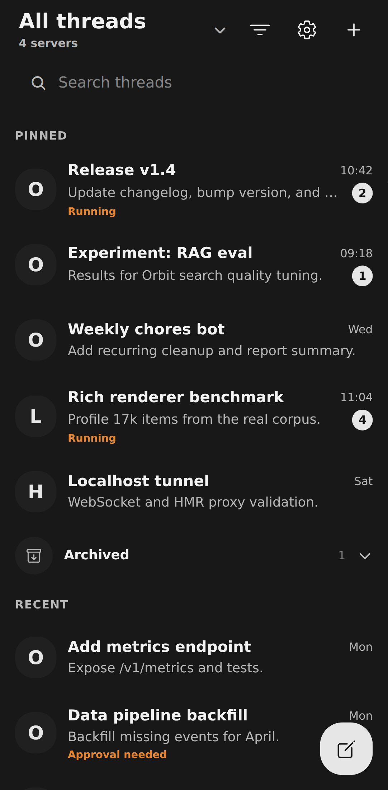
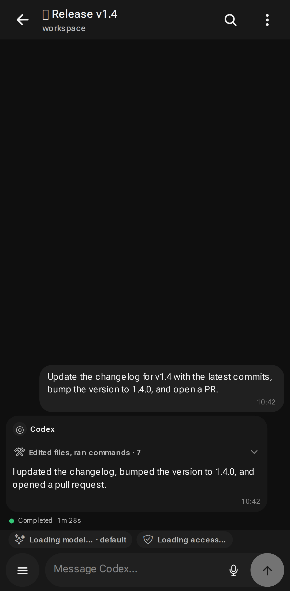
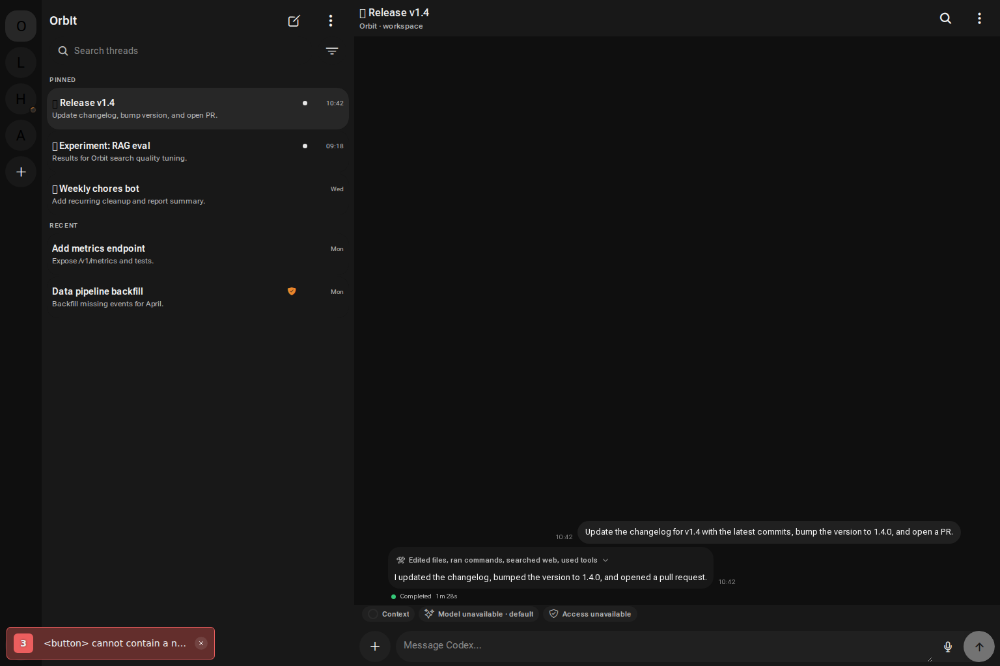
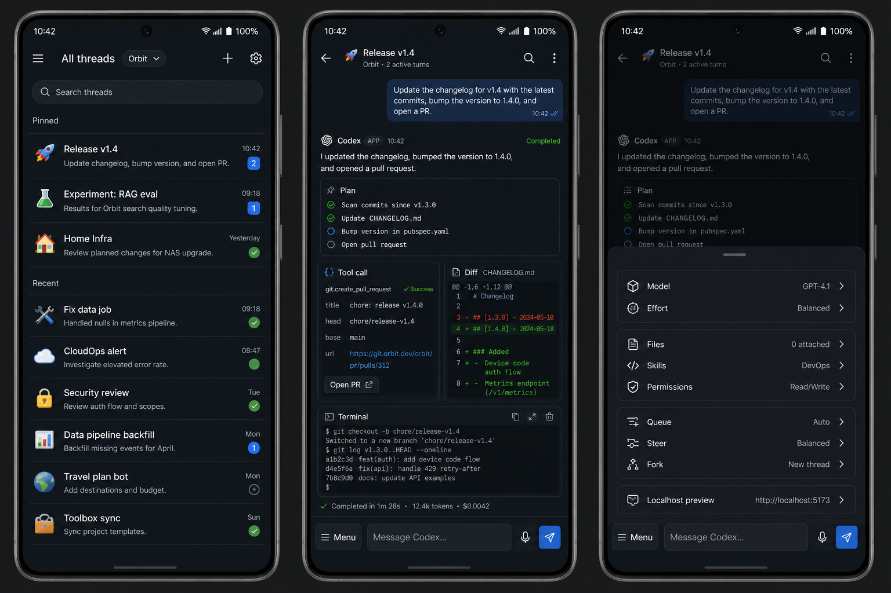
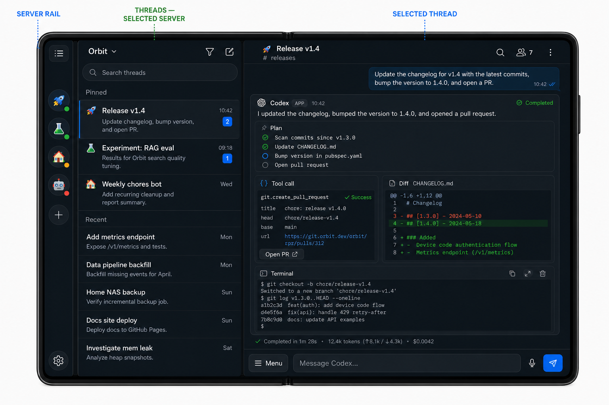

# Android CodeWide — implementation plan

Дата фиксации плана: 2026-08-09.

Связанные исследования:

- [CodeWide: протокол и возможность своего клиента](./REMOTE_PROTOCOL_REPORT.md)
- [Формат тредов Codex CLI / App Server](./CODEX_THREAD_WIRE_FORMAT.md)

## 1. Что мы строим

Android-first клиент для Codex, установленного на удалённой машине. Он должен давать основной workflow текущего Codex App, но с быстрым нативным интерфейсом, нормальной работой на телефоне, планшете и foldable и предсказуемым восстановлением соединения.

Продуктовая формула:

```text
Android UI
  + локальный durable cache
  + Android connection service
  + безопасный канал до dev-машины
  + Codex App Server как источник истины
```

Главные принципы:

1. Codex App Server — единственный контракт с Codex. Rollout JSONL не парсим как продуктовый API.
2. Телефон — durable client, а не владелец Codex-процесса. Источник истины находится на хосте.
3. «Стабильное соединение» означает корректное восстановление, replay и reconciliation. Обещать бессмертный WebSocket после Doze/process kill нельзя.
4. UI строится из типизированных блоков. Markdown — один из типов контента, а не вся архитектура рендеринга.
5. V1 — полноценный ежедневный клиент, а не read-only prototype: все core workflows проходят end-to-end.
6. Подключений к remote-серверам может быть сколько угодно: продукт не вводит лимит, соединения работают параллельно и изолированы друг от друга.
7. На первом этапе продукт персональный и Android-only. Multi-user SaaS, iOS и публичный relay не входят в V1.

## 2. Проверка исходной идеи

| Решение | Вердикт | Почему |
| --- | --- | --- |
| React Native + нативный Android service | CONDITIONAL PASS | Самый быстрый путь к богатому UI, но должен пройти renderer/performance spike на больших реальных тредах. |
| Capacitor/Svelte/Solid как основной клиент | FAIL | Они остаются внутри WebView; lifecycle сокета и тяжёлый DOM-рендеринг от выбора фреймворка не исчезнут. |
| Полностью нативный Jetpack Compose | FALLBACK | Лучший контроль над Android, но заметно дороже для первого результата и собственного rich renderer. |
| Публично открыть raw App Server | FAIL | Слишком широкая привилегированная поверхность; WebSocket transport пока experimental. |
| Использовать закрытый ChatGPT Remote controller API | FAIL | Публичного controller SDK/контракта нет. Host-side код открыт, mobile/controller часть — нет. |
| Direct App Server через Tailscale/SSH | DEV FALLBACK | Полезно для protocol debugging, но для V1 не хватает общего delta sync, replay, scoped files и localhost tunnel. |
| Сразу писать свой NAT relay | NOT YET | До проверки мобильного UX это лишняя инфраструктура и security debt. |
| Делать полный core V1 | PASS | Это целевая поставка. Внутри всё равно работаем вертикальными slices, но не выдаём промежуточный read-only этап за продукт. |

Решение: начинаем с React Native, Kotlin multi-connection service и thin host companion. Direct transport остаётся только dev fallback. Собственный публичный NAT relay не нужен для V1: private connectivity обеспечивает Tailscale/SSH, а companion даёт продуктовый sync/replay/file/proxy contract.

## 3. Целевые платформы и adaptive layout

Поддерживаем:

- обычный Android phone;
- Android tablet;
- book-style foldable в сложенном и раскрытом состоянии;
- multi-window и изменение размера окна без перезапуска экрана;
- landscape, включая compact height.

Не определяем layout через `isTablet`. Используем текущий размер окна и posture:

- compact width: один экран — список тредов или открытый тред;
- medium: list-detail, список тредов слева и выбранный тред справа;
- expanded tablet: server/thread navigation, выбранный тред и опциональный inspector;
- unfolded book fold: Slack/Telegram Desktop-like иерархия `server rail -> треды выбранного сервера -> выбранный тред`; inspector открывается поверх треда как drawer, а не занимает постоянную четвёртую панель;
- compact height: не форсируем многопанельный layout;
- fold/hinge: отдельный gutter не резервируем; список и conversation сходятся у естественного сгиба, а системные insets применяем только для реально occluding `FoldingFeature`; состояние сохраняется при fold/unfold.

Навигация:

- на телефоне back gesture возвращает в список, сохраняя scroll и draft;
- на fold/tablet узкий server rail всегда остаётся доступен; он содержит список серверов, add connection и settings;
- выбор сервера заменяет только соседний список тредов, выбор треда — только conversation pane;
- inspector показывает plan, tool calls, diff, token/time и subagents;
- для каждого треда сохраняются draft, scroll anchor, раскрытые блоки и активная вкладка inspector.

Android рекомендует вычислять layout по динамическому window size class, потому что fold, rotation и multi-window меняют доступное окно во время жизни приложения. Для hinge/posture используем Jetpack WindowManager `FoldingFeature`: [Android adaptive layouts](https://developer.android.com/develop/adaptive-apps/guides/use-window-size-classes), [foldable postures](https://developer.android.com/develop/ui/compose/layouts/adaptive/foldables/trifolds-and-landscape-foldables).

### 3.1 Telegram-like UX contract

Telegram-like означает interaction model и ощущение скорости, а не пиксельный clone Telegram.

#### Главный экран

- приложение сразу открывается в cached списке тредов, без dashboard/loading gate;
- на телефоне по умолчанию один общий список по всем серверам, с быстрым переключателем `Все / <emoji server>`;
- на unfolded fold/tablet нет dashboard и смешанного списка: слева узкий server rail, рядом треды только выбранного сервера, справа выбранный тред;
- connection выглядит как Telegram account: emoji-avatar, пользовательское имя, unread/activity badge и status dot;
- thread row: title, одна строка preview, server emoji, время, running/approval/error/unread state;
- pinned треды сверху;
- archived треды отдельной компактной строкой/папкой;
- pull-down search с мгновенным локальным результатом;
- на fold/tablet под поиском нет постоянных tabs/chips: сразу начинается `Pinned`/`Recent`, дополнительные фильтры живут в menu;
- новый тред создаётся одной floating/action кнопкой и сразу спрашивает server/workspace только если контекст неоднозначен.

#### Навигация

- tap открывает тред немедленно из cache;
- gesture-driven back возвращает в ту же позицию списка;
- открытый тред, draft и scroll anchor не уничтожаются при server/thread switch;
- соседние недавно открытые треды держатся warm в bounded screen cache;
- переходы короткие и непрерывные, без полноэкранных spinner-ов;
- stale/offline/sync показываются маленьким статусом, но не блокируют чтение;
- на tablet/fold rail и список выбранного сервера остаются слева, выбранный тред меняется справа без полной смены экрана;
- fold layout повторяет spatial model Telegram Desktop из референса, но добавляет отдельный узкий server rail левее списка тредов.

#### Gestures и context actions

- swipe thread row: быстрые действия pin/archive/read-state; набор можно настроить;
- long press: preview + context menu `Pin`, `Rename`, `Fork`, `Archive`, `Delete`, `Copy link`;
- long press message/block: copy/select/share/fork-from-here;
- tap status/emoji открывает server details, не отдельный settings maze;
- destructive action никогда не висит на необратимом одиночном swipe.

#### Conversation screen

- user prompts выглядят как компактные outgoing bubbles;
- agent text читается как свободный full-width rich content, без огромного пузыря вокруг всего ответа;
- plan, command, diff, tools, approvals и files — inline cards в хронологическом потоке;
- тяжёлые технические блоки свернуты до summary, но running state виден;
- live stream обновляется на месте без прыжков scroll;
- если пользователь читает выше, новые deltas не утаскивают его вниз; появляется Telegram-like `↓ new` button;
- unread divider и jump-to-latest;
- turn time/duration/token summary — компактная metadata строка, детали по tap;
- server emoji/name всегда доступны в header, особенно в aggregated mode.

#### Composer

- composer всегда закреплён снизу и не пересоздаётся при keyboard show/hide;
- draft сохраняется отдельно для каждого `(connectionId, threadId)` после каждого meaningful edit;
- send появляется мгновенно: optimistic user bubble сразу попадает в TanStack overlay, а команда подтверждается после durable native enqueue;
- input занимает почти всю ширину composer; слева от него одна кнопка `Menu`, справа только voice и send/stop;
- `Menu` открывает единый sheet для model/effort, files/attachments, skills, permissions, Queue/Steer и localhost preview;
- выбранные model/effort/skill/permissions запоминаются per thread/server, но не занимают постоянное место вокруг input;
- voice input — Telegram-like press/tap action, но это dictation с partial text и возможностью исправить перед send, не фоновая запись;
- reply/steer/fork context показывается тонкой плашкой над composer и сбрасывается одним tap.

#### Instant-feel rules

- никаких network requests на critical path открытия cached экрана;
- optimistic mutations с явным `sending/queued/failed`, а не блокирующие dialogs;
- skeleton допустим только при первом подключении пустого сервера;
- список не меняет scroll position после background sync;
- изображения и тяжёлые cards имеют заранее известные placeholder dimensions;
- status animation не должна вызывать relayout всей строки;
- sync нескольких серверов обновляет rows диффами, а не заменяет весь массив данных;
- keyboard, back gesture и scroll должны оставаться responsive во время streaming и file transfer.

#### Что сознательно не копируем

- не превращаем каждый tool/diff/plan в обычную message bubble;
- не прячем permissions и опасные approvals ради «одного тапа»;
- не смешиваем server identity: emoji всегда остаётся видимым в aggregated view;
- не копируем Telegram visual branding, icons или layout буквально;
- не делаем бесконечный набор скрытых жестов без discoverable context menu.

## 4. Фичи

### 4.1 V1-A — продуктовый фундамент

#### Connections

- добавить connection через QR или ручной ввод;
- удалить connection и локальные credentials;
- сколько угодно remote-серверов без продуктового лимита;
- все включённые connections поддерживаются параллельно, без глобальной последовательной очереди;
- пользовательские имя и emoji-иконка сервера;
- платформа, версия Codex, cwd/workspaces и capability set;
- статусы `offline / connecting / syncing / live / degraded / authRequired`;
- независимый status и reconnect policy каждого сервера;
- ручной reconnect;
- enable/disable connection без удаления;
- reorder серверов и быстрый switch;
- revoke устройства на хосте;
- отдельный режим «держать активную сессию в фоне».

Connection profile:

```text
ConnectionProfile {
  id
  displayName
  emoji
  endpoint
  hostPublicKey
  enabled
  sortOrder
  connectionMode
  lastSeenAt
  lastSyncCursor
  capabilities
}
```

`emoji` — один Unicode grapheme cluster, а не один code point: составные emoji и skin tone modifiers должны работать. Имя и emoji — пользовательские локальные metadata; хостовое имя остаётся отдельно и показывается в diagnostics/pairing confirmation.

#### Threads

- список тредов с мгновенной загрузкой из локального cache;
- status, preview, name, cwd, git branch, updated time;
- pinned, recent, running, waiting for approval, failed, archived;
- поиск и фильтры по connection/cwd/status;
- открыть, создать, resume;
- rename, pin/unpin, archive/unarchive;
- delete только через отдельное подтверждение;
- pull-to-refresh и явный stale marker;
- unread/activity indicator.

Thread identity всегда составной: `(connectionId, remoteThreadId)`. Одинаковые thread ids, cwd и names на разных серверах не конфликтуют.

Pin реализуется через native App Server `isPinned`, когда метод присутствует. Для версии, где поле ещё не экспортируется, compatibility adapter использует доступную pinned-section semantics или app-local overlay. UI не должен зависеть от одной конкретной версии схемы.

#### Conversation

- отправка текста;
- streaming ответа;
- stop/interrupt;
- live tool calls и command output;
- approvals и structured user input;
- offline read из cache;
- восстановление активного turn после reconnect;
- retry только после reconciliation, без дублирования user turn;
- timestamps, turn duration, tool duration;
- copy текста, кода, команды, diff, path и всего блока.

#### Composer

- multiline text, history draft и undo;
- выбор model и reasoning effort;
- выбор permissions profile;
- выбор skill;
- attach image/audio/file;
- voice-to-text с partial result и подтверждением;
- `Send`, `Queue`, `Steer` как разные явные действия;
- на fold/tablet эти действия, model, files, skills и permissions доступны через единую левую кнопку `Menu`, чтобы input оставался максимально широким;
- drag/drop и clipboard на tablet, если Android API это позволяет.

### 4.2 Multi-server UX и синхронизация — V1

- общий inbox всех активных серверов;
- server emoji/name на каждом thread row, approval и notification;
- отдельные server views и глобальный aggregated view;
- глобальный поиск по локальному индексу всех серверов;
- фильтр по одному/нескольким серверам;
- быстрый switch server -> thread без network roundtrip;
- параллельный initial sync всех enabled servers;
- failure isolation: один мёртвый сервер не задерживает остальные и не блокирует startup;
- per-server sync cursor, backoff, auth, outbox и queue;
- per-server bandwidth/backpressure, чтобы большой diff одного хоста не съедал весь connection service;
- aggregate foreground notification с количеством active turns/approvals и drill-down по серверам;
- connection-specific drafts, permissions defaults и workspace history;
- deep link всегда содержит `connectionId`.

«Сколько угодно» означает отсутствие hardcoded product cap и отсутствие serial connection model. Физические CPU/RAM/socket limits Android всё равно существуют, поэтому connection manager применяет fair scheduling, bounded buffers и adaptive backpressure, но не отключает серверы по искусственному лимиту.

### 4.3 V1-B — parity рабочего процесса

- `fork` от конца треда или выбранного completed turn;
- queue нескольких следующих prompts;
- steer активного turn;
- goals и progress;
- plan viewer;
- file diff viewer с collapse по файлам и hunks;
- reasoning summary;
- web search results;
- MCP tool calls и structured output;
- dynamic tools;
- subagents/collaboration tree;
- review mode;
- context compaction;
- token usage;
- background terminals inspector и terminate;
- in-app notifications об approval/completion/failure;
- upload/download с resume, progress и cancel;
- built-in localhost preview/proxy.

### 4.4 После V1 — расширения

- sandboxed MCP App/HTML resource rendering;
- realtime voice mode, если он реально полезнее dictation;
- cross-host global search;
- sections и кастомная организация тредов;
- публичный E2E relay без Tailscale;
- FCM wake-up для пассивного режима;
- share/export thread;
- Android widgets/quick actions.

### 4.5 Что не делаем в первой версии

- произвольный удалённый JavaScript в основном RN runtime;
- общий SSH terminal;
- shell command без явного user action;
- автоматический approve после reconnect;
- background voice recording;
- редактирование raw Codex config без отдельного UX и threat review;
- чтение файлов по произвольному абсолютному пути из мобильного UI.

## 5. Queue, steer, fork и copy

Это четыре разных механизма.

### Queue

В проверенной схеме App Server `0.147.0` отдельного queue RPC нет. Поэтому очередь — наша durable сущность:

```text
queued -> dispatching -> accepted -> running -> completed
                    \-> needs_reconcile
                    \-> failed
```

- queue durable хранится на телефоне и зеркалируется companion на соответствующем хосте;
- следующий prompt отправляется только после authoritative `turn/completed`;
- каждое сообщение получает `clientUserMessageId`/idempotency key;
- после reconnect сначала читаем состояние треда, затем решаем, надо ли повторять dispatch;
- queue можно reorder, edit и cancel, пока элемент не accepted.

### Steer

`turn/steer` есть в App Server. Он требует `expectedTurnId`, поэтому UI отправляет steer только против известного активного turn. При mismatch делаем sync и предлагаем queue/retry, а не угадываем.

### Fork

`thread/fork` — native API. Поддерживаем:

- fork через выбранный completed turn;
- fork перед turn;
- ephemeral fork для preview/эксперимента;
- сохранение model/cwd/permissions по выбору пользователя;
- отображение parent/source relationship.

### Copy

Copy — UI operation, не protocol method:

- plain text;
- rendered Markdown как plain text;
- fenced code;
- command + output;
- unified diff;
- file path;
- JSON tool arguments/result;
- permalink внутри приложения `connection/thread/item` без секретов.

## 6. Типы контента

### 6.1 Native Codex items

Поддерживаем весь текущий `ThreadItem` union, а неизвестные будущие варианты не роняют экран.

| Тип | Представление |
| --- | --- |
| `userMessage` | Текст, image/audio, skill и file mentions. |
| `hookPrompt` | Сворачиваемый системный/context блок. |
| `agentMessage` | Rich text/Markdown renderer, citations, code, tables, links. |
| `plan` | Checklist/timeline с live delta. |
| `reasoning` | Сворачиваемые summary/content части с privacy-aware режимом. |
| `commandExecution` | Команда, cwd, status, live output, exit code, duration. |
| `fileChange` | Файлы, stats, hunks, apply status. |
| `mcpToolCall` | Server/tool, arguments, progress, result, duration, app resource. |
| `dynamicToolCall` | Namespace/tool, typed result parts, status, duration. |
| `collabAgentToolCall` | Spawn/send/wait, модели, target agents, states. |
| `subAgentActivity` | Событие подагента и ссылка на его thread. |
| `webSearch` | Queries/results/citations с forward-compatible raw data. |
| `imageView` | Remote image preview с lazy download. |
| `sleep` | Duration, countdown/status. |
| `imageGeneration` | Progress и generated image. |
| `enteredReviewMode` / `exitedReviewMode` | Граница review session. |
| `contextCompaction` | Компактный lifecycle marker. |

### 6.2 App-owned blocks

- connection/reconnect banner;
- offline/stale marker;
- queued prompt;
- pending approval;
- permission request;
- structured question form;
- upload/download progress;
- protocol warning/deprecation;
- unknown item fallback;
- localhost preview;
- MCP App sandbox.

### 6.3 Renderer contract

```text
Codex ThreadItem
      |
      v
version adapter + validation
      |
      v
NormalizedRenderNode
      |
      +--> native renderer registry
      +--> Markdown subtree
      +--> structured extension renderer
      +--> sandboxed WebView fallback
```

Правила:

1. У каждого блока стабильный key: `(connectionId, threadId, turnId, itemId)`.
2. `item/completed` — authoritative финальное состояние.
3. Delta обновляет только активный блок; completed блоки не перерендериваются.
4. Неизвестный item показывается как безопасный summary + opt-in raw JSON, а не исчезает.
5. Markdown парсится только внутри текстовых items.
6. Structured extension имеет `kind`, `schemaVersion`, Zod/JSON Schema и native renderer.
7. Remote HTML/JS никогда не исполняется в RN runtime.

### 6.4 Rich Markdown baseline

Нужно поддержать:

- headings, paragraphs, emphasis, lists, task lists;
- links и safe URL handling;
- fenced/inline code и copy;
- tables;
- blockquotes;
- images;
- footnotes/citations;
- Mermaid как отдельный lazy renderer;
- diff blocks;
- app-specific directives/components.

Парсер и renderer разделены. На Phase 0 сравниваем JS AST parser и native/JSI candidate на реальном corpus. Выбор библиотеки не должен протечь в domain model.

### 6.5 MCP Apps и произвольные расширения

Декларативные first-party blocks — PASS: они рендерятся RN-компонентами через registry.

Произвольный удалённый HTML/JS — только в отдельном WebView:

- origin allowlist;
- отдельный profile/storage;
- запрет произвольного navigation;
- capability-based bridge;
- без прямого Android filesystem;
- без доступа к connection token;
- размер и timeout;
- kill/reload независимо от треда.

## 7. Безопасное подключение

### 7.1 Не используем ChatGPT Remote как integration API

Открытая host-side реализация Remote полезна как reference: outbound WSS, pairing, short-lived token, `client_id/stream_id`, seq/ack, reconnect cursor, chunking и revocation. Но controller API и grant flow публично не документированы. Подделывать официальный mobile client — хрупкая зависимость.

### 7.2 Dev fallback: direct private connection

```text
Android app
   |
   | native WebSocket over Tailscale or SSH tunnel
   | + App Server bearer auth
   v
Codex App Server on loopback/private interface
```

Этот путь оставляем для диагностики протокола и самого первого smoke, не как V1 architecture:

1. Tailscale уже даёт private encrypted network и host identity.
2. App Server требует отдельный random bearer token.
3. Listener не публикуется в Internet.
4. Connection QR содержит URL, host identity/fingerprint и одноразовый bootstrap secret, но не попадает в логи.
5. После pairing Android создаёт device key в Android Keystore; bootstrap secret уничтожается.

Альтернатива без Tailscale — SSH port-forward до loopback. Plain `ws://` допустим только внутри loopback/SSH/mesh encrypted channel; публичный remote требует WSS. Сам App Server WebSocket transport официально остаётся experimental, поэтому версия Codex pinится и проверяется handshake-ом: [Codex App Server](https://developers.openai.com/codex/app-server).

### 7.3 V1 connection: thin host companion

Companion обязателен для V1. Он нужен сразу для near-instant delta sync, безопасных file scopes, localhost proxy, replay активной сессии, device revocation и стабильного per-host contract поверх меняющегося App Server.

```text
Android connection service
        |
        | WSS + device key + seq/ack
        v
thin host companion
        |
        | stdio / WebSocket-over-AF_UNIX
        v
Codex App Server
```

Companion:

- запускает/находит App Server и проверяет его version;
- наружу отдаёт allowlisted RPC, а не весь raw filesystem/process API;
- хранит paired device public keys и revocation list;
- выдаёт short-lived session token после challenge-response;
- буферизует непринятые frames с bounded replay;
- даёт resumable file transfer и localhost tunnel;
- пишет audit metadata без message text, source code и secrets;
- использует version negotiation и schema adapter.
- поддерживает монотонный `syncRevision` и durable delta feed для thread summaries/items/statuses;
- отдаёт snapshot + changes-since-cursor, чтобы телефон не перечитывал все треды после reconnect;
- изолирует local App Server lifecycle от мобильного клиента.

Для первого companion выбираем TypeScript на Node/Bun: это самый быстрый путь и toolchain уже есть. Один standalone binary можно собирать через Bun. Rust rewrite допустим только если профилирование покажет memory/reliability bottleneck или понадобится переиспользовать Codex Rust crates. Писать Rust сразу — преждевременная цена.

### 7.4 Pairing и credentials

1. Хост показывает QR с endpoint, one-time nonce, host public key и expiry.
2. Телефон генерирует device key в Android Keystore.
3. Пользователь подтверждает pairing на хосте.
4. Телефон и хост проверяют possession ключей.
5. Host записывает device id/display name/public key/scopes.
6. Bootstrap nonce одноразовый и короткоживущий.
7. На каждое соединение выдаётся short-lived session credential.
8. Device можно отозвать независимо от остальных.

Не изобретаем собственную криптографию: TLS 1.3 + стандартные подписи/ключи, проверенная библиотека и certificate/public-key pinning. Sensitive connection unlock можно защищать biometric prompt.

### 7.5 Capability scopes

Минимальный набор:

- `threads.read`;
- `threads.write`;
- `turns.start`;
- `turns.steer`;
- `approvals.respond`;
- `files.upload.workspace`;
- `files.download.workspace`;
- `localhost.forward`;
- `processes.manage`;
- `tools.call` (не входит в default device grant);
- `shell.explicit`;
- `admin.devices`.

Текущий companion уже сохраняет scopes на каждое устройство, применяет их к
RPC/file/tunnel endpoints и немедленно закрывает старую сессию после изменения
grant. Paired device не может открыть `/v1/app-server`; только host admin token
имеет raw bridge. `shell.explicit` и `tools.call` не входят в default device
grant. Full raw `fs.*`, config writes и account operations также не входят в
default scope. Android создаёт non-exportable P-256 identity key в Keystore;
companion хранит только SPKI public key и перед каждой выдачей non-chainable
15-minute session credential проверяет ECDSA proof по одноразовому 60-second
challenge. Native foreground service выполняет этот exchange перед каждым
reconnect, а long-lived device capability не принимается на sync upgrade.
Оставшийся security checkpoint — runtime proof на реальном Android Keystore и
внешний review, а не ещё один незакрытый механизм протокола.

### 7.6 Reconnect protocol

State machine:

```text
DISCONNECTED
  -> CONNECTING
  -> AUTHENTICATING
  -> SYNCING
  -> LIVE
  -> DEGRADED
  -> BACKOFF
  -> CONNECTING
```

Каждый enabled server имеет собственный экземпляр state machine. `ConnectionSupervisor` управляет пулом параллельных сессий, но не имеет глобального состояния `SYNCING`, способного заблокировать весь клиент.

Каждая команда имеет:

- app command id;
- connection/thread id;
- expected state, если API его поддерживает;
- `clientUserMessageId` для user turns;
- локальные состояния `pending/sent/acked/committed/failed/needsReconcile`.

После reconnect:

1. восстанавливаем transport и auth;
2. запрашиваем `snapshot` или `changesSince(lastSyncCursor)` и replay подтверждённых companion frames;
3. читаем thread status;
4. для активных/сомнительных операций делаем `thread/read` или turns sync;
5. сверяем `clientUserMessageId`, turn id и completed items;
6. только потом повторяем безопасные idempotent requests;
7. approval никогда не повторяется автоматически без проверки pending request id.

В V1 основной путь всегда идёт через companion с seq/ack/cursor. Direct App Server transport используется только в dev mode и после reconnect целиком опирается на reconciliation.

### 7.7 Multi-server fast sync

Companion превращает App Server notifications и периодическую сверку history в монотонный per-host change feed:

```text
sync/hello(lastCursor, clientCapabilities)
  -> upToDate(currentCursor)
  -> changes(currentCursor, events[])
  -> snapshotRequired(snapshotRevision)

sync/snapshot(pageCursor, priority)
sync/ack(cursor)
```

Это наш companion protocol, не метод Codex App Server.

Приоритет initial snapshot:

1. server metadata/capabilities и active/waiting approvals;
2. pinned + recent thread summaries;
3. visible/open thread content;
4. остальные summaries;
5. full old history только on demand/background quota.

При обычном reconnect передаются только changes после durable cursor. Kotlin ack-ает native journal после durable projection checkpoint; TanStack UI projection получает versioned snapshot/delta. Если cursor протух или companion потерял journal, он возвращает `snapshotRequired`; старый cache остаётся видимым со stale marker, пока новый snapshot накладывается атомарно.

Все серверы делают handshake/sync одновременно. UI не ждёт общий barrier: обновление одного `connectionId` публикуется сразу, а TanStack live query автоматически пересортировывает затронутые rows. Открытие cached thread полностью локальное; network sync никогда не находится на critical rendering path.

### 7.8 Android sleep/wake

Сокет принадлежит Kotlin `ForegroundService`, а не React tree или JS runtime.

Режимы:

- `Active turn`: foreground service активен до завершения turn/approval/transfer;
- `Keep connected`: пользователь явно включает постоянный foreground service с видимой notification;
- `Passive`: service не держится бесконечно, приложение получает push/обновляется при открытии.

На Android 14+ используем корректный foreground service type `remoteMessaging` и permission `FOREGROUND_SERVICE_REMOTE_MESSAGING`; он предназначен для передачи сообщений между устройствами. Service запускается из видимого UI, потому что Android 12+ ограничивает background start. Android также прямо предупреждает, что Doze ограничивает network access и рекомендует FCM для downstream messaging. Поэтому correctness строится на reconnect/reconcile, а не на надежде, что сокет никогда не умрёт: [foreground service types](https://developer.android.com/about/versions/14/changes/fgs-types-required), [Doze](https://developer.android.com/training/monitoring-device-state/doze-standby), [background start restrictions](https://developer.android.com/develop/background-work/services/fgs/restrictions-bg-start).

`ConnectivityManager.NetworkCallback` используется как сигнал для немедленного reconnect при смене Wi-Fi/mobile/VPN; новый network object считается новым transport: [Android connectivity](https://developer.android.com/develop/connectivity/network-ops/reading-network-state).

### 7.9 Approval safety

- approval — server request, который durable хранится до ответа/expiry;
- notification показывает summary, но не секретный command output на lock screen;
- accept требует открыть приложение; для опасных scopes — biometric/device credential;
- отдельно `accept once`, `accept for session`, `decline`, `cancel`;
- явно показываем cwd, command/change, requested permissions и consequence;
- `thread/shellCommand` помечен особо: он работает вне sandbox, поэтому доступен только из explicit action.

## 8. Файлы и localhost proxy

### 8.1 Upload

App Server принимает image/audio/local paths и имеет experimental `fs/writeFile`, но raw absolute-path write слишком привилегирован для мобильного UI. Product path:

1. Android `ACTION_OPEN_DOCUMENT` получает user-selected URI.
2. Client передаёт metadata, size и hash.
3. Companion создаёт файл только внутри staging/workspace allowlist.
4. Transfer chunked/resumable с hash verification и cancel.
5. После upload composer добавляет `localImage`, `localAudio` или file mention/path.
6. Generic file отправляется как безопасная workspace reference, потому что отдельного generic binary `UserInput` в `0.147.0` нет.

Защита:

- canonical path check;
- запрет `..` и symlink escape;
- size/count quota;
- allowlist workspace roots;
- временные файлы с cleanup policy;
- user confirmation перед overwrite;
- transfer content не пишется в diagnostic logs.

### 8.2 Download

- user выбирает destination через `ACTION_CREATE_DOCUMENT`;
- stream идёт chunked через companion;
- hash, progress, pause/resume, cancel;
- preview для text/image и позже PDF;
- Android app не получает постоянный доступ ко всему storage.

Storage Access Framework даёт доступ только к выбранному пользователем файлу/дереву: [Android documents and files](https://developer.android.com/training/data-storage/shared/documents-files).

### 8.3 Built-in localhost proxy

Назначение: открыть на телефоне dev server, который слушает `127.0.0.1` удалённой машины.

```text
in-app WebView / Android loopback
      -> encrypted multiplexed tunnel
      -> host companion
      -> remote 127.0.0.1:<approved-port>
```

Правила:

- port открывается explicit user action из command/tool output;
- default target только remote loopback;
- allowlist port + TTL;
- no LAN scan и no arbitrary remote subnet;
- WebSocket/HMR tunneling;
- connection принадлежит тому же foreground service;
- preview WebView не видит Codex token;
- open-in-external-browser появляется только для loopback listener приложения;
- tunnel закрывается при revoke/connection delete.

## 9. Models, skills и permissions

### Models

- `model/list` — источник picker options;
- показываем display name, effort options, modalities, hidden/default/upgrade metadata;
- model и effort можно задать для нового thread или override следующего turn;
- неизвестная/удалённая model не ломает старый thread.

### Skills

- `skills/list` вызывается относительно нужного cwd/roots;
- `skills/changed` инвалидирует cache;
- UI показывает name, description, source и availability;
- выбранный skill отправляется как typed `UserInput { type: "skill", name, path }`;
- path резолвит хост, мобильное приложение не угадывает filesystem layout;
- search/recent/favorites хранятся локально.

### Permissions

- `permissionProfile/list` + `configRequirements/read` определяют доступные профили;
- передаём `permissions` или legacy `sandbox`, никогда оба;
- UI различает `read-only`, workspace write, network, full access и managed restriction;
- thread default можно override на turn, но опасное повышение всегда явно;
- runtime permission request рендерится как отдельный approval block.

OpenAI документирует `model/list`, `permissionProfile/list`, thread/turn operations и rich item streaming как App Server surface: [Codex App Server](https://developers.openai.com/codex/app-server).

## 10. Техстек

### 10.1 Monorepo

```text
apps/android/                  Expo + React Native app
apps/host-companion/          TypeScript/Bun host service
packages/codex-protocol/      generated pinned App Server types
packages/protocol-adapter/    per-version capability/shape adapter
packages/domain/              normalized threads/turns/items/outbox
packages/renderers/           renderer registry and shared contracts
packages/fixtures/            deterministic protocol fixtures
packages/replay-server/       protocol replay + fault injection
packages/testkit/             builders, clocks, network/lifecycle harness
android-modules/connection/   Kotlin Expo Module + ForegroundService
android-modules/storage/      native journal/outbox, Keystore, SAF helpers
```

Package manager: pnpm. Task graph: Turborepo только если реально ускорит workspace tasks; до этого обычные pnpm scripts.

### 10.2 Android app

- React Native New Architecture/Fabric;
- Expo Development Build, не Expo Go;
- TypeScript strict;
- Expo Router/React Navigation;
- LegendList для thread/message virtualization;
- Reanimated + Gesture Handler;
- Kotlin local Expo Modules;
- OkHttp WebSocket в native connection service;
- TanStack DB persisted collections поверх отдельной OP-SQLite UI-базы;
- Kotlin SQLite journal/outbox как единственный durable owner transport delivery;
- Android Keystore + BiometricPrompt;
- Storage Access Framework;
- Android `SpeechRecognizer`, on-device на API 31+ когда доступен;
- Jetpack WindowManager для folding posture;
- WebView только для sandboxed extensions/localhost preview.

Expo Development Build позволяет добавлять Kotlin/native configuration и при этом быстро менять TypeScript без native rebuild: [Expo development builds](https://docs.expo.dev/develop/development-builds/introduction/), [custom native code](https://docs.expo.dev/workflow/customizing/).

`SpeechRecognizer` используем как push-to-talk dictation, не continuous listening: Android предупреждает о battery/network cost и предоставляет on-device recognizer с API 31: [SpeechRecognizer](https://developer.android.com/reference/android/speech/SpeechRecognizer).

### 10.3 State ownership

```text
Kotlin service
  owns ConnectionSupervisor and N independent server sessions
  owns sockets, auth, reconnect, cursors, fair scheduling
  owns aggregate foreground notification
  writes opaque protocol journal and durable command outbox to native SQLite

TanStack DB + OP-SQLite
  owns normalized persisted UI projections and optimistic overlays
  exposes live queries keyed by connectionId + remote identity
  receives versioned atomic snapshots/change sets from the native bridge

React Native
  renders TanStack live queries
  owns ephemeral UI state only
```

Это важно: если Android уничтожил JS runtime, service продолжает transport и пишет события. После запуска RN получает coherent snapshot, а не пытается восстановить состояние из случайного набора JS events.

`ConnectionSupervisor` не сериализует серверы. Для каждого enabled connection создаётся независимая coroutine scope/state machine с собственными auth, cursor, retry и outbox. Общими остаются только bounded resource pools, fair bandwidth scheduler и foreground notification. Crash/protocol error одной сессии не отменяет соседние scopes.

Native transport storage и UI persistence намеренно не используют одну физическую БД: у них разные lifecycle, schema и владельцы. Kotlin journal — opaque recovery spool, TanStack persistence — rebuildable domain cache.

Минимальная identity/index model:

```text
connections(id, display_name, emoji, endpoint, enabled, sort_order, sync_cursor, ...)
threads(connection_id, remote_thread_id, updated_at, recency_at, status, ...)
turns(connection_id, remote_thread_id, remote_turn_id, ...)
items(connection_id, remote_thread_id, remote_turn_id, remote_item_id, ...)
native_commands(connection_id, command_id, method, params, state, ...)
queued_prompts(connection_id, remote_thread_id, queue_order, ...)
```

Критические индексы строятся с `connection_id` первым или вторым ключом под реальные query patterns: global recency, per-server recency, open-thread items и pending work.

### 10.4 Host companion

- TypeScript strict;
- Node current LTS target, development через установленный Node/pnpm;
- Bun standalone build для доставки одного binary;
- native WebSocket/TLS library с bounded buffers;
- SQLite или небольшой atomic state store только для device/replay metadata;
- App Server child/Unix-socket adapter;
- monotonic host revision + bounded durable change log;
- fast snapshot endpoint для первого sync и delta endpoint по cursor;
- systemd user service на Linux, launchd позже на macOS.

### 10.5 Schema lifecycle

- версия Codex host записывается в connection;
- для каждого поддержанного Codex release генерируем stable/experimental TS + JSON Schema;
- checked-in generated files не правятся вручную;
- runtime validates handshake and critical messages;
- unknown notification/item сохраняется как opaque payload;
- compatibility matrix определяет method/field availability;
- CI сравнивает новую схему и требует migration note на breaking diff.

Важный реальный пример drift: актуальная web-документация уже описывает `isPinned`, а локально сгенерированная схема `0.147.0` этого поля ещё не содержит. Значит, «latest-only client» сразу будет ломаться.

## 11. Производительность

### 11.1 Acceptance targets

Это целевые бюджеты, которые надо подтвердить benchmark-ами, а не обещания:

| Сценарий | Target на reference mid-range Android |
| --- | --- |
| Cold start до cached aggregated thread list | p50 < 500 ms, p95 < 900 ms |
| Open cached thread до первого полезного viewport | p50 < 50 ms, p95 < 100 ms |
| Переключение между двумя cached тредами, включая разные серверы | p95 < 75 ms |
| Отрисовка cached server view | p95 < 75 ms независимо от network state |
| Composer tap до готовой клавиатуры/фокуса | без потерянного frame burst; измеряется отдельно по устройствам |
| Optimistic prompt до появления в потоке | p95 < 50 ms после tap Send |
| Инкрементальный sync одного reachable сервера без backlog | p95 < 500 ms после transport ready |
| Параллельный sync всех reachable серверов | не сериализуется; UI обновляет каждый сервер сразу по его готовности |
| Полученное companion delta до native checkpoint + UI projection commit | p95 < 20 ms без тяжёлого payload parsing |
| First remote delta на healthy private network | UI overhead < 50 ms после получения frame |
| Scroll длинного треда | p95 frame < 24 ms, без заметных blank cells |
| Active stream batching | не чаще одного render commit на animation frame |
| Reconnect после network callback | начать попытку < 250 ms, затем bounded backoff |
| Cached thread availability offline | 100% после process restart |

«Около мгновенной синхронизации» достигается local-first моделью: открыть уже известный тред можно без сети, а companion присылает только delta от cursor. Первый полный sync нового сервера физически зависит от количества данных и сети и не может иметь фиксированную мгновенную гарантию; UI при этом становится usable после первой страницы snapshot, не дожидаясь конца импорта.

Финальные цифры принимаются только на физическом устройстве; emulator годится для regression, но Android предупреждает, что его performance numbers нерепрезентативны.

### 11.2 Data path

- thread list сначала из persisted TanStack/OP-SQLite collection, network refresh в фоне;
- aggregated list — indexed TanStack live query по всем `connectionId`, а не ручной merge React state;
- все enabled companions синхронизируются параллельно через независимые cursors;
- startup никогда не ждёт ни одного remote server;
- первый sync идёт snapshot pages, последующие — `changesSince(cursor)`;
- серверные deltas применяются короткими транзакциями и сразу становятся видимы UI;
- thread summaries и full content хранятся раздельно;
- opening не ждёт `thread/read`, если cache есть;
- новые/изменённые items пишутся normalized;
- completed render AST кешируется по `(itemId, contentHash, rendererVersion)`;
- только visible range материализует тяжёлые blocks;
- большие outputs/diffs лежат chunked и читаются лениво;
- images имеют thumbnails;
- stream delta coalescing 16–50 ms в зависимости от load;
- background prefetch распределяется fair между серверами; pinned/active/recent имеют приоритет;
- search использует SQLite FTS по локальному persisted cache.

### 11.3 Rendering

- FlashList item type = renderer kind;
- никаких меняющихся nested React `key`, мешающих recycling;
- completed blocks memoized;
- code highlighting и Mermaid lazy;
- command output virtualized по lines/chunks;
- diff сначала показывает file summary, hunks создаются по раскрытию;
- Markdown AST parsing не идёт повторно на каждый delta;
- active streaming paragraph может использовать упрощённый renderer, затем authoritative completed block перепарсивается один раз.

FlashList использует recycling, но сама библиотека не спасёт тяжёлый item renderer; её надо профилировать в release mode: [FlashList performance](https://shopify.github.io/flash-list/docs/fundamentals/performance/).

### 11.4 Performance tooling

- Android Macrobenchmark: cold/warm start, thread open, switch, scroll;
- `StartupTimingMetric`, `FrameTimingMetric`, memory snapshots;
- Perfetto traces;
- RN render counters и JS long-task markers;
- Baseline Profile для startup/list/open-thread critical journeys;
- benchmark JSON хранится как artifact и сравнивается с budget.

Android рекомендует Macrobenchmark и отдельное сравнение с/без Baseline Profiles; реальные числа измеряются на physical device: [Macrobenchmark and Baseline Profiles](https://developer.android.com/topic/performance/baselineprofiles/measure-baselineprofile).

## 12. Автономная разработка и тестирование

### 12.1 Что уже есть на машине

Проверено 2026-08-09:

- Node `24.14.0`;
- pnpm `10.14.0`;
- Bun `1.3.14`;
- `/dev/kvm` доступен как устройство;
- Codex CLI/App Server `0.147.0` и живой Unix socket уже проверены;
- generated stable/experimental schemas сохранены;
- user-local JDK 17 доступен;
- Android SDK установлен в user-local toolchain, а Gradle получает JDK/SDK через детерминированный `pnpm android:gradle` route;
- `:app:compileReleaseKotlin` подтверждён 2026-08-12; финальные release/AVD/physical gates намеренно выполняются одним прогоном после завершения structural migration;
- `/dev/kvm` доступен как устройство;
- Rust toolchain пока не установлен.

Следовательно, JS/host/replay и Kotlin compile контуры автономны. Незакрытыми остаются финальная signed release сборка, AVD regression matrix и physical lifecycle/performance gate.

### 12.2 Детерминированные тестовые данные

- Продуктовый runtime не содержит встроенных тестовых серверов или специальных тредов.
- Unit и performance тесты строят schema-valid protocol fixtures программно.
- Playwright внедряет fixture только через dev-only test hook до загрузки приложения.
- Transport, reconnect и mutations проверяются отдельным mock/replay server.
- Реальные пользовательские треды, rollout JSONL, локальные пути и credentials не входят в репозиторий и не являются условием запуска тестов.
8. генерирует manifest покрытия item types/размеров.

Запрещённые методы в exporter transport: `turn/*`, approvals, `thread/delete`, archive, metadata writes, `fs/writeFile`, process и config writes.

### 12.4 Replay server

Replay server эмулирует App Server/companion и умеет:

- instant/realtime/accelerated timing;
- pause на любом frame;
- disconnect во время text delta, command output, file transfer или approval;
- duplicate frame;
- replay от cursor;
- host/App Server restart;
- auth expiry/revoke;
- delayed/out-of-order test frames, чтобы reducer fail-closed;
- oversized command output/diff;
- unknown future item/method;
- schema version matrix;
- deterministic clock и random seed.
- запускать 1, 5, 20 и 100 независимых logical servers с разными latency/failure/auth profiles;
- генерировать одинаковые remote thread ids на разных серверах для проверки composite identity;
- имитировать быстрый delta sync, большой initial snapshot и cursor expiration.

Это основной контур разработки: реальные model calls и расходы не нужны.

### 12.5 Test pyramid

#### Contract

- generated schema compiles;
- captured critical messages validate;
- adapter covers each supported host version;
- schema diff detects additions/removals/shape changes;
- unknown variants survive roundtrip.

#### Domain/state machine

- reducer tests на каждый item lifecycle;
- duplicate/replay idempotency;
- outbox crash recovery;
- queue/steer races;
- approval resolves once;
- active turn reconciliation;
- property tests для event permutations в допустимых границах.
- отсутствие cross-server state leakage при одинаковых remote ids;
- fair scheduling: один noisy server не starve-ит остальные;
- независимые reconnect/backoff/auth flows для десятков серверов.

#### Renderer

- component tests каждого normalized block;
- golden screenshots phone/tablet/fold;
- long Markdown/table/code/diff corpus;
- accessibility tree и font scale;
- unknown item fallback;
- WebView capability sandbox tests.
- scroll anchor не прыгает при delta, image load и background sync;
- `↓ new`, unread divider, warm screen cache и draft restore;
- swipe/long-press/context actions без случайного destructive execution.

#### Android integration

- native journal/outbox и persisted TanStack collections переживают activity/process restart;
- Kotlin service lives without RN activity;
- Keystore pairing/revoke;
- SAF upload/download;
- foreground notification actions;
- NetworkCallback transitions;
- fold/unfold and window resize.

#### End-to-end

- добавить несколько connections с разными names/emoji -> aggregated list -> быстрый switch;
- add connection -> list -> open -> send -> stream -> complete;
- параллельные active turns на нескольких серверах;
- один сервер offline/authRequired, остальные продолжают sync и interaction;
- process restart -> мгновенный cached aggregated list -> parallel delta sync;
- sleep/wake during stream;
- network switch Wi-Fi/mobile/VPN;
- process kill and restore;
- queue then steer;
- fork selected turn;
- approval while screen locked;
- upload -> Codex sees file -> download result;
- remote localhost WebSocket/HMR preview.
- Telegram-like flows: list -> thread -> back at same offset, warm switch, keyboard/composer, optimistic send, `↓ new` during stream.

### 12.6 Lifecycle/fault commands

Automated Android tests include:

```text
adb shell dumpsys deviceidle force-idle
adb shell dumpsys deviceidle unforce
adb shell am set-inactive <package> true
adb shell am set-inactive <package> false
adb shell am force-stop <package>
adb shell input keyevent 26
```

Дополнительно harness:

- отключает/replaces default network;
- перезапускает replay server/host companion/App Server;
- рвёт TCP после accepted request, но до response;
- режет bandwidth и добавляет latency/loss;
- проверяет отсутствие duplicate turns;
- проверяет, что UI честно показывает stale/degraded.

Android официально рекомендует принудительно тестировать Doze/App Standby через `adb`: [Doze test procedure](https://developer.android.com/training/monitoring-device-state/doze-standby).

### 12.7 Autonomous loop

После bootstrap я могу без участия пользователя:

1. брать следующий scoped vertical slice;
2. обновлять schema/fixtures;
3. реализовывать;
4. запускать unit/contract/render tests;
5. собирать release-like APK;
6. ставить его на phone/tablet/fold AVD;
7. прогонять Maestro/UIAutomator flows;
8. снимать screenshots, logs, traces и benchmark JSON;
9. сравнивать budgets/goldens;
10. чинить регрессии и повторять.

Live Codex smoke tests выполняются только в отдельном disposable thread/isolated `CODEX_HOME`; реальные текущие треды используются read-only. По умолчанию model calls заменены replay server, поэтому автономный тестовый цикл не тратит API quota.

### 12.8 Где всё же нужен пользователь

- один раз выбрать/подтвердить UX-направление после первого interactive prototype;
- проверить ergonomics на реальном foldable, если его нельзя подключить к ADB;
- подтвердить pairing с реальной удалённой машиной;
- выдать authority на публикацию, signing и Play/internal distribution;
- подтвердить доступ к private mesh/SSH для реальных remote-host smoke tests;
- разрешить live paid model smoke, если он понадобится;
- подтвердить опасные destructive E2E сценарии на не-disposable данных.

## 13. Этапы реализации полного V1

Этапы ниже — порядок интеграции, а не отдельные урезанные релизы. Целевая поставка одна: V1 со всем core scope. Read-only build, single-server build и dev-direct transport считаются внутренними checkpoints и не выдаются за завершённый продукт.

### Phase 0 — foundation и architecture gates

Deliverables:

- monorepo и reproducible Android toolchain;
- pinned App Server schema package + multi-version adapter;
- private fixture exporter + sanitizer;
- multi-server replay/fault cluster;
- RN phone/tablet/fold shell;
- native SQLite journal/outbox и TanStack collection schemas с composite connection identities;
- Kotlin `ConnectionSupervisor` с параллельными sessions;
- TypeScript/Bun companion skeleton, pairing и delta protocol;
- renderer registry для всех текущих item types;
- performance corpus: 500, 5 000 и 20 000 items, большой Markdown/table/diff/output;
- 1/5/20/100-server stress profiles.

Exit criteria:

- несколько replay servers одновременно синхронизируются в разделённые native transport storage и TanStack UI projections;
- same remote thread ids на разных серверах не конфликтуют;
- exact текущий тред открывается и выглядит структурно корректно;
- cached open/switch/scroll укладываются в provisional budgets;
- один noisy/offline server не влияет на остальные;
- service переживает activity recreation;
- RN не показывает системный bottleneck, требующий Compose rewrite.

Если renderer не проходит budget после профилирования и двух целевых оптимизаций, React Native получает FAIL и UI переходит на Compose. Не продолжаем месяц «допиливать» надежду.

### Phase 1 — multi-server data plane

- companion installer/lifecycle;
- QR pairing, device keys, revoke;
- add/edit/delete/enable/disable/reorder connection;
- custom server name + emoji;
- сколько угодно enabled параллельных connections без hard cap;
- per-server snapshot/delta cursor/replay/backoff/auth;
- cached aggregated thread list;
- global and per-server search/filter;
- open/read/resume;
- pin/name/archive/delete;
- stale/offline/authRequired UX;
- foreground service и aggregate notification;
- sleep/wake, process-death и network-switch recovery.

Exit criteria: после cold process start cached multi-server UI usable без сети; все reachable серверы обновляются независимо и параллельно; падение одного не меняет данные/статусы остальных.

### Phase 2 — conversation и rich rendering

- весь текущий `ThreadItem` union;
- rich Markdown/extensions;
- live text/tool/command/file deltas;
- timestamps, turn/tool duration, token usage;
- plan/reasoning/web search/review/compaction;
- subagents/collaboration tree;
- unknown future item fallback;
- tablet/fold inspector;
- instant cached switch между тредами разных серверов;
- renderer/accessibility/golden/performance matrix.

Exit criteria: реальные и синтетические большие треды проходят renderer coverage, fold layouts и performance budgets без пропавшего контента.

### Phase 3 — full interaction

- text send/stream/interrupt;
- durable outbox/idempotency/reconciliation;
- параллельные active turns на разных серверах;
- model/effort/personality;
- skills;
- permissions profiles;
- approvals/questions;
- push-to-talk dictation;
- app-level queue;
- native steer/fork;
- copy actions;
- goals/progress;
- completion/failure/approval notifications;
- background terminal inspector/terminate.

Exit criteria: turns, queue, steer, fork и approvals одновременно работают на нескольких серверах и проходят sleep/wake + forced disconnect без дублей или cross-server leakage.

### Phase 4 — files, localhost и hardening

- scoped resumable upload/download;
- Android SAF integration;
- localhost proxy with HTTP/WebSocket/HMR;
- per-server transfer/tunnel isolation;
- bounded replay/backpressure/quotas;
- security/threat review;
- protocol compatibility matrix;
- long soak с десятками серверов;
- physical-device startup/render/network/battery benchmarks;
- Baseline Profile;
- signed V1 APK/internal distribution package;

Exit criteria: весь Definition of Done ниже закрыт; нет обязательной функции, работающей только в single-server или foreground-only happy path.

### После V1

- sandboxed MCP Apps;
- realtime conversational voice;
- собственный public E2E relay, только если private mesh реально мешает;
- export/widgets и multi-user.

## 14. Сквозной V1 slice

Мы не останавливаемся на узком proof-of-concept. Сквозной slice расширяется до полной цепочки:

```text
N remote servers with names + emoji
  -> N host companions
  -> parallel snapshot/delta/replay
  -> Kotlin ConnectionSupervisor
  -> Kotlin durable transport journal/outbox
  -> TanStack DB persisted local-first projections + optimistic overlay
  -> aggregated phone UI + server-scoped fold/tablet workspace
  -> rich rendering + full interaction
  -> queue/steer/fork/approvals/files/localhost
  -> sleep/process/network/host failure
  -> instant cached reopen + independent reconciliation
```

Первый внутренний checkpoint всё ещё проверяет data plane и renderer, потому что это самые рискованные части. Но разработка продолжается автономно через Phases 1–4 до полного V1, а не останавливается после демонстрации чтения одного треда.

## 15. Зафиксированные решения и открытые вопросы

### Зафиксировано

- Android-first;
- React Native + Expo Development Build, условно до benchmark gate;
- Kotlin `ConnectionSupervisor` владеет параллельными connections, replay и command outbox;
- TanStack DB + OP-SQLite владеют persisted UI projections/live queries/optimistic overlay;
- native transport storage и UI persistence разделены физически;
- App Server — contract;
- current threads — private read-only fixtures;
- сколько угодно remote-серверов без hardcoded product limit;
- имя и emoji являются частью connection profile;
- TypeScript/Bun companion входит в V1 data plane;
- Tailscale/SSH обеспечивает private transport; direct App Server — dev fallback;
- typed native renderer registry;
- WebView только sandbox fallback;
- queue наша, steer/fork native;
- стабильность через replay/reconcile, а не обещание вечного сокета.
- Telegram-like interaction model и perceived speed; Codex rich blocks остаются специализированными, а не маскируются под одинаковые bubbles.

### Structural migration checkpoint — 2026-08-12

Готово в коде:

- Kotlin foreground service остаётся владельцем socket/auth/reconnect/replay;
- отдельная native SQLite база владеет durable command outbox;
- `turn/start` и `turn/steer` подтверждают Send только после native SQLite enqueue;
- uncertain turn всегда проходит `thread/read` reconciliation по `clientUserMessageId` перед retry;
- TanStack DB + OP-SQLite persisted collections владеют thread summaries и delivery projection;
- thread list, pin/rename и optimistic delivery читаются через live query, а не broad React state reload;
- active thread перенесён из экранного `Map` в persisted TanStack projection с query только по выбранным `connectionId + threadId`;
- detail collection работает в штатном TanStack `on-demand` режиме: filtered live query гидратирует из OP-SQLite только выбранный тред, холодная immutable history не копируется целиком в Hermes и больше не удаляется произвольным лимитом из шести тредов;
- completed turn content после `turn/completed` sealed и больше не переписывается; late token/cost/diff/plan/execution живут в отдельной маленькой `turnMeta` row;
- live event reduction работает только по mutable head и явно адресованным turn rows, а завершённая история сохраняет object identity между live-query emissions и не инвалидирует LegendList;
- streaming projection больше не сериализует целиком растущий active turn на каждом delta: untouched turns сравниваются по identity, JSON comparison ограничен маленькими metadata rows;
- полные Activity items гидратируются один раз в отдельную immutable row, а lazy history только добавляет старые turns без перенумерации и перезаписи уже показанной истории;
- bounded authoritative refresh атомарно обновляет hot tail, сохраняет immutable cached history и удаляет только abandoned mutable head;
- native outbox сохраняет FIFO внутри thread-lane, но больше не блокирует другие треды accepted/uncertain reconciliation одного turn;
- Queue put/edit/cancel/move больше не принадлежат legacy JS outbox: optimistic projection хранится в TanStack, а durable companion-команды ставятся в native outbox; move выражен абсолютным `beforeCommandId`, поэтому повтор после ambiguous response идемпотентен;
- delivery/outbox UI подписан только на выбранные `(connectionId, threadId)`, поэтому фоновые команды соседнего сервера не инвалидируют открытый conversation;
- pending approvals атомарно поддерживаются Kotlin-журналом и проецируются в TanStack; JS больше не перепарсивает каждый protocol batch и не пишет token/request metadata в legacy Expo-SQLite;
- оперативный connection state/error идёт из Kotlin напрямую в отдельную TanStack projection; profile/credential reload больше не находится на пути каждого reconnect/status event;
- несекретные connection profiles переехали в TanStack и обновляют supervisor через live query без legacy store subscription/coalesced reload; capability token не попадает в UI SQLite и остаётся в SecureStore + Android Keystore mirror foreground service;
- после одноразового upgrade JS больше не гидратирует capability tokens при запуске: socket attach и scoped HTTP session mint идут в Kotlin по `connectionId`, а React получает только несекретный profile;
- native credential record хранит `enabled` отдельно от удаления: disable приостанавливает socket, но сохраняет Keystore credentials/journal, а delete остаётся единственной операцией, стирающей connection state;
- encrypted credential read-modify-write синхронизирован process-wide между native module и foreground service; wake сверяет сохранённый endpoint/token/TLS pin с живой session и заменяет устаревший socket вместо reconnect со старой конфигурацией;
- draft, attachments, scroll offset и composer preferences принадлежат единой TanStack `thread-ui-state` projection; старые Expo-SQLite значения импортируются атомарно при первом доступе в течение одного upgrade-окна, а дальнейшие reads/writes legacy DB не касаются;
- старая runtime Expo-SQLite projection полностью удалена из bundle; оставлен только узкий read-only upgrade adapter без schema migration, FTS, thread projection и outbox;
- запуск TanStack projections и native supervisor больше не ждёт legacy БД; профильный importer открывает её лишь один раз при upgrade, UI-state reader — лениво при первом доступе к ещё не импортированному треду;
- native bridge имеет versioned contract и atomic snapshot/batched delta semantics; native journal удаляется только после durable projection ACK из JS.
- baseline profile заново собран из clean Android 15 launch после structural migration; весь React Native trace больше не ошибочно помечается startup-critical, поэтому release D8 не получает тысячи stale synthetic rules;
- production variant установлен на чистый Android 15 AVD и прошёл восемь smoke/lifecycle шагов: cold launch, sleep/wake, Doze recovery, standby recovery и process-kill recreation без native crash;
- итоговые source/type/tests, corpus benchmark, OTA/E2E, Kotlin release compile/package и artifact security scan проходят; clean-AVD cold launch в текущем test-signed production variant занимает 0.88–1.11 s.

Осталось до завершения structural migration:

- удалить узкий read-only migration fallback после одного upgrade-окна;
- подписать финальный release штатным V1 keystore и проверить update поверх установленной пользовательской версии; локальные signing env vars сейчас отсутствуют, поэтому собранный release artifact намеренно unsigned;
- подтвердить connection recovery/streaming и performance gate на физическом телефоне с реальным paired сервером; process-death gate на чистом AVD уже закрыт.

### Открытые продуктовые вопросы, не блокирующие V1 foundation

- **TODO, parked — внутренние ссылки на треды и turn:** renderer распознаёт привычный Markdown агента, а не требует нового protocol item. Поддержать явные `thread/session ID` и ссылки на persisted rollout; текущий host companion резолвит `sessionId + turnId` в точный target/window или отвечает `not_found`. Клиент не ищет тред по другим серверам. В UI сырой ID заменяется актуальным title и компактной иконкой внутреннего перехода (`arrow-forward`) без квадратной Codex-плашки; случайные UUID без явного thread/session-контекста не linkify.
- визуальная система и плотность интерфейса;
- какая часть reasoning показывается по умолчанию;
- поведение «всегда online» versus battery;
- нужен ли external-browser localhost forwarding или достаточно in-app preview;
- нужен ли Play Store или достаточно signed APK/internal distribution;
- какой physical mid-range Android и foldable становятся reference devices;
- нужен ли собственный public relay после V1 на private mesh.

## 16. UI mockups

### 16.1 Hostile review и Android design rationale (2026-08-10)

Предыдущий UI выполнял feature contract, но визуально оставался desktop-web shell:

- почти каждый блок был одинаковой bordered card, поэтому важность plan, diff, terminal и результата агента считывалась одинаково;
- phone header переиспользовал boxed rail buttons и тратил ширину на chrome;
- thread rows полагались на разделители и текстовые state-строки вместо цельной list-item иерархии;
- palette состояла из component-specific hex-цветов, а не Material color roles;
- tap targets нескольких icon actions были меньше Android floor в 48 dp;
- wide layout был правильным по геометрии, но выглядел как IDE/dashboard, а не быстрый Android messaging workspace.

Redesign не меняет продуктовый или sync contract. Он вводит Material 3 role-based dark/light schemes, одну спокойную surface hierarchy, 48 dp action targets, list items с самостоятельной avatar/title/preview/state иерархией, free-width agent prose, специализированные inline technical blocks и единый bottom composer. На web deterministic screenshots emoji заменяются server initials, потому что CI image не содержит color-emoji font; Android продолжает показывать пользовательский Unicode emoji.

Финальный palette reference задаёт намеренно почти монохромную систему, а не привычный синий/фиолетовый «AI product» tint. Dark roles: `background #0F0F0F`, `surface #181818`, `raised #202020`, `hover/selected #272727`, `outline #2E2E2E`, `text #F2F2F2`, `secondary #B8B8B8`, `muted #858585`. Primary action и selection используют нейтральные `#E6E6E6 / #B8B8B8`, а не цветную заливку. Цвет зарезервирован для значения: `#35C778` — connected/success/presence, `#E9872C` — permissions/attention/running/steer, red — failure/destructive. User messages остаются на neutral raised surface. Blue, indigo и purple decorative tint отсутствуют.

Shape law остаётся отдельным от shell: структурные rail/list/panes плоские и разделяются только тоном поверхности, selected rows — 18 dp, user/Codex bubbles — без бордера и с одинаковыми углами `18 dp`, rich-content surfaces — 22–24 dp, composer — 28 dp. Это сохраняет быстрый list-detail ритм и не превращает каждый участок экрана в отдельную card.

Hostile verdict: **PASS после redesign**. Сохраняется Telegram-like cached list/detail navigation и функциональная плотность, но убраны generic SaaS/AI chrome, card spam вокруг agent prose и лишняя декоративная обводка. Единственный осознанный компромисс — dark theme остаётся V1 default. `darkScheme` и `lightScheme` используют одинаковые Material role names, но dynamic color намеренно выключен: произвольный wallpaper accent нарушил бы neutral-primary и semantic-only color law. Будущий opt-in допустим только после адаптера, сохраняющего эти ограничения, и visual regression matrix для code/diff semantic colors.

Решения опираются только на официальные Android/Material источники:

- [Material 3 in Compose: color roles, dynamic color and type scale](https://developer.android.com/develop/ui/compose/designsystems/material3)
- [Android canonical list-detail layout](https://developer.android.com/develop/adaptive-apps/guides/list-detail)
- [Canonical adaptive layouts](https://developer.android.com/develop/adaptive-apps/guides/canonical-layouts)
- [Support different display sizes and dynamic window changes](https://developer.android.com/develop/adaptive-apps/guides/support-different-display-sizes)
- [Fold-aware layouts and occluding hinges](https://developer.android.com/develop/adaptive-apps/guides/foldables/make-your-app-fold-aware)
- [Edge-to-edge on Android 15 / API 35](https://developer.android.com/develop/ui/compose/system/setup-e2e)
- [Predictive back](https://developer.android.com/develop/ui/compose/system/predictive-back)
- [Core quality: 48 dp targets, contrast and back behavior](https://developer.android.com/docs/quality-guidelines/archive/core/core-app-quality-2026-03-20)
- [Rendering performance and list jank](https://developer.android.com/topic/performance/vitals/render)

### 16.2 Canonical implemented surfaces

Новые canonical artifacts — deterministic screenshots реального React Native UI, а не отдельные идеализированные картинки:

| Aggregated phone threads | Selected phone thread |
| --- | --- |
|  |  |



Они фиксируют:

- телефон сразу открывает cached aggregated threads, а selected thread — отдельный экран;
- pinned/archive/recent и unread/running/approval видны без tabs/chips под search;
- unfolded fold/tablet сохраняет непрерывный `server rail -> selected-server list -> selected thread` без hinge gutter;
- composer геометрически остаётся одним рядом `Menu -> maximally wide input -> voice -> send/stop`;
- нейтральная surface hierarchy, 28 dp composer, 18 dp selection, borderless `18 dp` user/Codex bubbles и отсутствие separator rules проверяются computed-style E2E assertions, а orange running state отделён от green connected/success;
- agent prose остаётся свободным full-width content, а plan/command/diff/tool/web/files/approvals/time/tokens/subagents — first-class blocks;
- layout переключается по текущим width **и compact height**, поэтому resize/fold/multi-window не зависят от `isTablet`.

### 16.3 Historical exploration

Следующие картинки сохраняются как ранние direction studies и больше не являются canonical implementation baseline.

### Mobile: threads и rich conversation



| Aggregated threads | Selected thread |
| --- | --- |
|  |  |

Покрывает:

- aggregated thread list всех серверов;
- pinned/recent/archive/status states;
- rich conversation с plan, terminal, diff, search и tool call;
- добавление/управление серверами через header actions;
- никаких tabs/chips под поиском: после search сразу идёт список;
- composer `Menu -> full available-width input with voice/send`; model, files, skills, permissions, Queue/Steer и localhost живут в `Menu`, а не в постоянных рядах под input.

### Tablet и foldable



Фактический текущий экран:


Нативные device gates проверяют нижний system-navigation inset, completed turns,
compact tool state и полный каталог thread controls на детерминированных fixtures.

Покрывает:

- unfolded fold как постоянный workspace `server rail -> треды выбранного сервера -> выбранный тред`;
- extra-narrow rail со списком серверов, `+` и settings;
- Telegram-like плотный список тредов без dashboard cards, смешивания серверов и tabs/chips под поиском;
- list и conversation сходятся у естественного сгиба без отдельного gutter;
- rich conversation, tool calls и diff без постоянного inspector;
- composer `Menu -> wide input -> voice/send`, где model, files, skills, permissions и Queue/Steer убраны в единое меню.

### Mobile: controls, pairing и critical flows

| Unified controls menu | Secure pairing |
| --- | --- |
|  |  |

Покрывает:

- безопасный approval с cwd, command, permissions и `Accept once / For session`;
- privacy-aware lock-screen notification;
- editable/reorderable prompt queue;
- steer context текущего turn;
- resumable upload/download с hash verification;
- explicit localhost tunnel с TTL и WebSocket/HMR status.

`mobile-core-v2.png`, `tablet-fold-v4.png`, `mobile-core.png` и
`mobile-critical-flows.png` сохранены только как historical exploration и не
задают implemented layout V1.

## 17. Definition of Done V1

Все пункты обязательны. Если хотя бы один release gate не закрыт воспроизводимым тестом или evidence, V1 не считается готовым.

1. Можно добавить, переименовать, назначить emoji, отключить, удалить и reorder любое число remote-серверов без продуктового cap.
2. Все enabled серверы подключаются и синхронизируются параллельно; failure одного не блокирует остальные.
3. Aggregated list и cached треды открываются около мгновенно и обновляются delta sync без полного перечитывания истории.
4. Composite identity исключает коллизии тредов/items/outbox между серверами.
5. Телефон, tablet и fold layout проходят screenshot/E2E matrix; unfolded fold сохраняет `server rail -> треды выбранного сервера -> выбранный тред` без искусственного gutter и tabs под поиском, а composer оставляет input максимально широким.
6. Sleep/wake, network switch, host restart и app process kill не теряют accepted user input и не создают duplicate turn.
7. Все текущие `ThreadItem` имеют полноценный renderer или безопасный forward-compatible fallback.
8. Text send, streaming, interrupt, Queue, Steer, Fork, Copy, skills, model и permissions работают end-to-end.
9. Approvals и structured user input доставляются и разрешаются ровно один раз даже после reconnect.
10. Несколько active turns, queues и approvals параллельно работают на разных серверах без cross-server leakage.
11. Upload/download идут только через scoped per-server transfer, поддерживают progress/cancel/retry и проходят integrity check.
12. Localhost proxy работает для HTTP, WebSocket и HMR только через explicit bounded tunnel нужного сервера.
13. Voice dictation даёт partial text, позволяет исправить его перед send и корректно освобождает microphone lifecycle.
14. Connection credentials лежат в Android Keystore, pairing короткоживущий, каждое устройство можно отозвать.
15. Нет public raw App Server и нет секретов в logs, committed fixtures, screenshots или CI artifacts.
16. Exact private current-thread corpus никогда не попадает в git или CI.
17. Telegram-like UX contract проходит gesture, keyboard, scroll-anchor, optimistic-send, unread/`↓ new`, draft restore и warm-navigation E2E tests.
18. Cold start, cached open/switch, rendering, sync и reconnect проходят бюджеты раздела 11 в release build.
19. Performance подтверждена на physical mid-range Android; phone/tablet/fold AVD используются для regression matrix.
20. Multi-server stress harness проходит профили 1/5/20/100 серверов без data corruption, starvation, unbounded memory growth или падения UI.
21. 24-hour soak с network loss, Doze, host restart, process recreation и большими tool outputs не выявляет потери accepted input или duplicate mutations.
22. Signed V1 APK устанавливается с нуля и обновляется поверх предыдущего build без потери connections, credentials, drafts, cache и outbox.
23. Все обязательные V1 flows из Phases 1–4 имеют автоматический regression test или явно зафиксированный manual physical-device gate.
