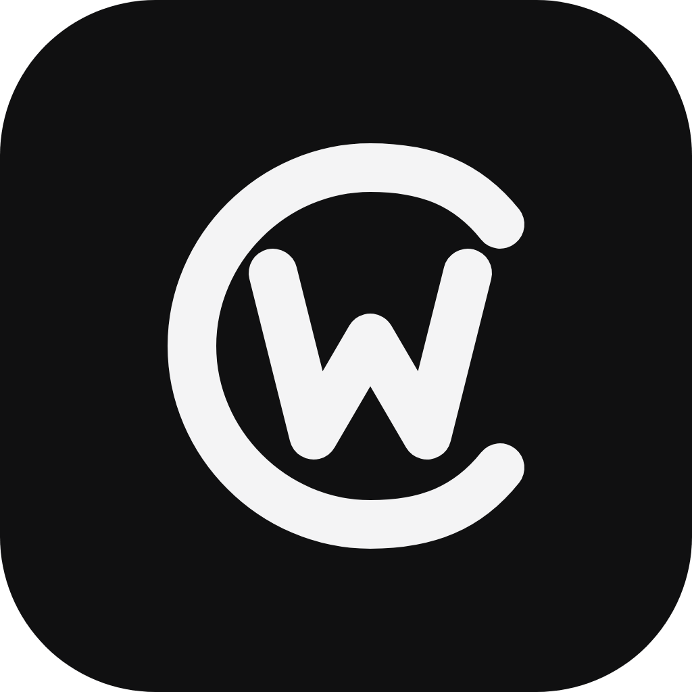

<p align="center">
  
</p>

<h1 align="center">CodeWide</h1>

CodeWide is an Android-first agentic IDE for working with Codex on remote
development machines.

## Current executable surface

- Expo 57 / React Native 0.86 adaptive phone, tablet, and unfolded-fold UI.
- Slack/Telegram Desktop-style fold workspace: server rail, selected-server threads,
  selected thread.
- Typed domain identities that isolate equal remote thread IDs across servers.
- Rich renderer registry with bounded fallback for unknown future items.
- Live structured plans, turn diffs, token usage and bounded MCP progress.
- Durable SQLite cache/outbox/drafts/pending approvals with batched delta commits.
- Native Android foreground WebSocket service with replay journal, network callbacks,
  and voice dictation bridge.
- Authenticated loopback companion bridging WebSocket frames to the managed
  App Server over its Unix WebSocket socket.
- One-time device pairing/revocation, scoped file transfer, and bounded localhost
  previews plus native phone-local TCP forwarding for HTTP, WebSocket and HMR.
- Companion-owned durable prompt queue with reconnect reconciliation and delivery
  receipts, plus goals/progress, review, compact, steer and boundary-aware fork.
- A full-width composer with a left control menu for model/effort, files,
  skills, permissions and delivery mode; no filter tabs below thread search.
- Typed root-scoped file/image/audio inputs with persisted attachment drafts and
  authenticated inline previews for scoped remote files. Arbitrary external
  image URLs still require the authenticated media-proxy gate.
- Bounded, schema-valid per-server outboxes with exactly-once reconciliation and
  explicit backpressure instead of invisible overflow.
- Deterministic protocol fixtures for rendering, synchronization, and performance tests.

CodeWide is distributed under the [MIT License](LICENSE).

## Commands

```sh
pnpm install
pnpm typecheck
pnpm test
pnpm bench:fixtures
pnpm test:e2e
pnpm security:scan-artifacts
pnpm security:scan-secrets
pnpm --filter @codewide/android build
cargo test --workspace
cargo clippy --workspace --all-targets -- -D warnings
cargo run -p codewide-companion -- --help
```

`pnpm security:scan-secrets` runs pinned Gitleaks against both reachable Git
history and the tracked/untracked non-ignored working tree. The verified binary
is cached outside the repository; set `CODEWIDE_GITLEAKS_BIN` to use an existing
installation instead.

Serve every locally available Android APK from a compact build shelf with a
stable latest-build marker and resumable byte-range downloads:

```sh
python3 scripts/build-shelf-server.py --host 127.0.0.1 --port 4190
```

The shelf scans Gradle APK outputs and archived test builds on every request.
While it is running, each new `release/app-release.apk` is also copied once into
`builds/android/`, with its version metadata and SHA-256, so rebuilding does not
erase the recent download history. The archive keeps the eight newest APKs and
their metadata. `/latest.apk` always resolves to the highest release version
code; `/api/builds` exposes the current catalog; `/healthz` is the lightweight
tunnel probe.

Run the logical multi-server recovery soak (24 hours by default):

```sh
pnpm soak:sync
```

It writes a private mode-`0600` progress/result artifact under
`test-results/soak/`. This exercises replay, network drops and JS runtime
recreation; it does not replace the physical Android Doze/device gate.

Run the UI in a browser during renderer development:

```sh
pnpm --filter @codewide/android web
```

For Android JS/TS Fast Refresh, install the debug APK once. Keep Metro on the
workstation loopback and provide an operator-owned HTTPS endpoint through
`CODEWIDE_METRO_URL`; the phone then needs neither USB nor ADB and may use any
network:

```sh
pnpm dev:android
```

The debug application id is `dev.codexremote.app.dev`, so it can remain
installed beside the signed release app. Open the `codewide://` URL printed
by the helper once; subsequent JS/TS edits arrive through Fast Refresh. Metro
signs its development manifest with the same local OTA key. On Linux it also needs a sufficiently large
inotify budget (`fs.inotify.max_user_watches=524288` and
`fs.inotify.max_user_instances=1024`).

The `dev.codexremote.app` package identity and related legacy storage, service,
and deep-link aliases are retained intentionally. They let existing installs
upgrade to CodeWide without losing local state or breaking saved links.

For the signed release app, publish JS/TS, message-renderer, and asset changes
without rebuilding or reinstalling the APK:

```sh
./scripts/release-ota
```

The one-shot command discovers the private OTA key and public update endpoint,
runs the Android release checks, publishes atomically, verifies the public
manifest and bundle hash, and prints the update ID as JSON. Use `--dry-run` to
validate release configuration without publishing.

The build shelf serves the signed Expo Updates protocol at `/api/updates`.
A release app checks once when its UI opens and at most once every 30 minutes
while it remains active, downloads a new compatible bundle, and immediately
recreates its JS runtime with that bundle. The Android process does not need to
be force-stopped; transient UI state may be reset. The signing key defaults to
the user data directory under `codewide/ota/private-key.pem` and can be
overridden with `CODEWIDE_OTA_PRIVATE_KEY`. Only the public certificate is
checked in.

Changes to Kotlin, the Android manifest, native libraries, or native dependency
versions still require a new APK and a new `runtimeVersion`; the updater rejects
bundles built for a different native runtime.

## Server-side voice transcription

The composer records mono PCM16 at Android's native routed sample rate. Native
callbacks use roughly 100 ms capture frames, but those frames are not network
requests: the client coalesces them into ordered one-second batches and keeps
exactly one `companion/dictation/appendBatch` RPC in flight. Stop flushes the
partial batch before `companion/dictation/finish`, so a long recording cannot
be reordered and a short recording cannot lose its tail.

The companion writes the private PCM stream in capture order, wraps bounded WAV
segments, and calls the ChatGPT transcription endpoint only after Stop. Codex
OAuth stays on the host; microphone audio and credentials are never persisted
by the Android client. Retryable rate limits retain the host-side recording only
until explicit retry/cancel or idle cleanup.

Build and install the companion as a user service:

```sh
pnpm build:companion
target/release/codewide-companion create-token
apps/companion/deploy/install.sh
codewide-companion pair
```

The packaged service exposes an HTTP carrier. Put it behind any ordinary
public-CA TLS ingress, Tailscale, ngrok, or another relay. Application traffic
uses a separate TLS 1.3 connection inside the blind WebSocket carrier, so the
relay cannot read it. Tell the CLI which public `wss://` URL belongs in the QR:

```sh
set -lx CODEWIDE_PUBLIC_ENDPOINT wss://host.example/v1/sync
set -lx CODEWIDE_SERVER_NAME 'Home workstation'
set -lx CODEWIDE_SERVER_EMOJI '🏠'
codewide-companion pair
```

`pair` reads the Companion identity through the private control socket and puts
its SHA-256 SPKI pin in the QR. A current Android build establishes pinned inner
TLS before it sends the one-time pairing token, public device key, or proof. The
initial challenge/session exchange and all later private traffic stay inside it.
The public carrier exposes no authentication or application data routes; it
accepts only the blind `/v1/e2ee-tunnel` plus Build Shelf / update downloads.

Secure transport is mandatory. Pairing payloads and saved profiles without a
Companion identity pin are rejected and must be paired again. There is no
preview switch, legacy transport, automatic trust-on-current-carrier upgrade,
or downgrade path.

Scan the terminal QR from `Add server`, or enter the one-time token manually.
The CLI selects compact Unicode, ANSI, or a private SVG fallback with
`--qr auto`; use `--qr unicode|ansi|svg` to force a renderer.
The QR expires after five minutes and contains a secret: do not paste it into
logs or share a screenshot. Remote endpoints must use `wss://`; plain `ws://`
is accepted only for loopback, the Android emulator host alias, or an SSH
forward terminating on the device. `serve --insecure-http` is retained only as
a hidden command-line compatibility no-op; it no longer disables or changes
inner TLS.

Build Shelf / OTA and Expo Updates intentionally remain carrier-level public
traffic. They do not pass through the native inner proxy because an app must be
able to download its own update before the application transport is available.

Inspect the public identity without exposing its private key:

```sh
codewide-companion identity
```

The private identity key is stored through the Companion Secure Store. It uses
the platform credential store when available (Keychain, Credential Manager, or
Linux keyring plus Secret Service) and records that backend durably. Headless
systems fall back to a mode-0600 file. A temporarily unavailable platform store
never causes silent key regeneration or a weaker fallback; a later successful
load may migrate the file-backed key upward.

Identity rotation is an explicit recovery event, not silent renewal. Stop the
service, rotate with acknowledgement, restart it, then scan a fresh QR on every
device. The previous private key is deleted and old pins fail closed:

```sh
systemctl --user stop codewide-companion.service
codewide-companion rotate-identity --confirm-device-repair
systemctl --user start codewide-companion.service
codewide-companion pair
```

The phone stores only its revocable per-device capability in Android
Keystore-backed SecureStore; the host persists only its SHA-256 hash and method
scopes plus the installation's public P-256 key. Before every socket reconnect,
the foreground service signs a one-use 60-second challenge with the
non-exportable Android Keystore key, then receives a non-chainable 15-minute
in-memory session token. A stolen bearer without that key cannot mint a session;
a long-lived device capability cannot open `/v1/sync`; and a paired device can
never open the raw `/v1/app-server` bridge. Raw shell execution and direct MCP
tool invocation are not granted by default.

The companion exposes registration and session minting through the single
public `/v1/auth` endpoint. Registration signs the one-time pairing token and
device metadata with the non-exportable Android Keystore key. The server derives
`deviceId` from that public key; the id is an identifier, not a secret or a
second factor. Copying either the id or the long-lived capability is insufficient
to mint a session without the private key. Pairing creation, device management,
health checks and the raw App Server bridge exist only on the OS-local control
endpoint and are not routed by the public server at all.

Inspect, restrict and revoke devices:

```sh
codewide-companion devices
codewide-companion scopes DEVICE_ID threads.read,turns.start
codewide-companion revoke DEVICE_ID
```

Changing scopes immediately closes that device's existing sync socket so the
new least-privilege grant applies on reconnect. It also closes that device's
active port-forward streams.

## Streaming telemetry

Android sends bounded structured telemetry batches to its own companion. The
schema contains timestamps, event names, numeric measurements, short tags and
explicit identifiers only; message text, prompts, protocol payloads and raw
state are rejected by both client and server. The companion stores at most
200,000 events for seven days in a separate `telemetry.redb`, deduplicated by
device and event id, so diagnostics cannot enlarge or lock the canonical thread
index.

Telemetry ingestion is session-authorized on the public endpoint. Reading it is
available only through the OS-local administrator control endpoint:

```sh
codewide-companion telemetry query --session-id THREAD_ID --descending
codewide-companion telemetry query --request-id REQUEST_ID
codewide-companion telemetry query --from-unix-ms 1787240000000 --to-unix-ms 1787240300000 --name stream.react_commit
```

Time filters use the companion receipt time, which remains useful when a phone
clock is skewed. Queries also accept `--device-id`, `--connection-id`,
`--batch-id`, `--client-session-id`, `--event-id`, `--thread-id`, `--turn-id`,
`--item-id`, exact `--tag-name`/`--tag-value` pairs and `--limit`.

## Interactive terminal

The Android thread menu can open a full-screen terminal workspace rooted at
that thread's working directory. Each Codex thread owns its own terminal tabs;
there is no global terminal. The companion owns every pseudo-terminal and sends
ordered binary input/output over a dedicated authenticated WebSocket at
`/v1/terminals`; Android owns the certificate-pinned socket, while
`expo-libghostty` provides VT parsing, rendering, selection, IME input and the
terminal accessory keyboard. The down-arrow minimizes the full-screen workspace
without stopping its shells. A `Terminals · N` chip beside the thread resources
restores it; only closing an individual tab terminates that shell. Android keeps
the ordered ANSI transcript in its cache so a recreated renderer can recover
after minimization without keeping hidden terminal views mounted. Transcripts
are deleted with their tabs and bounded to 128 MiB each. A connection shutdown,
thread deletion, or companion shutdown also closes the associated terminals.
The client and companion each permit at most eight concurrent sessions.

Remote shell access is intentionally absent from the default device grant. An
operator must add `shell.explicit` to the device's complete scope list through
the local control CLI; `scopes` replaces the list rather than appending to it:

```sh
codewide-companion devices
codewide-companion scopes DEVICE_ID approvals.respond,files.download.workspace,files.upload.workspace,localhost.forward,processes.manage,shell.explicit,threads.read,threads.write,turns.start,turns.steer
```

The current `expo-libghostty` React Native seam carries base64 strings across
the JS/native boundary. That encoding is confined to the renderer adapter; the
phone-to-companion transport remains binary, so replacing the seam later does
not change the terminal protocol. The native dependency ships 64-bit Android
artifacts only, so Android builds target `arm64-v8a` devices and `x86_64`
emulators rather than advertising a 32-bit terminal that cannot load.

## Phone-local port forwarding

The Android foreground service can expose a remote-machine loopback service as
`127.0.0.1:<phone-port>` on the phone. Each saved profile maps one remote
`127.0.0.1:<remote-port>` to an automatically selected or explicitly preferred
phone port. Profiles survive JS runtime recreation and reconnect after the
foreground service is restored; React only renders the native projection.

The companion lazily inventories listeners when the selected server is active.
It applies the same conservative recognition policy as Doma for Docker Compose,
Minikube, Kubernetes port-forwards, Hermes, Vite, Bun/Node, Python, zrok,
user processes and system-owned services. Stable service keys preserve an
include/exclude choice across ephemeral port changes. Known developer services
start automatically; system services and unknown ephemeral listeners stay in
`Available` until explicitly included. The Ports screen groups recognized
services, filters by name/category/port, and separates `Active`, `Available`
and `Excluded` entries.

A confirmed-live service opens as a full-screen app route, not inside the Ports
sheet. Its browser can dock the bundled Chromium DevTools Frontend below the
page and connects it to the inspected WebView through the real Chrome DevTools
Protocol. Elements, Console, Sources, Network, Application and the Performance
panel therefore use WebView's native CDP implementation rather than an injected
JavaScript console. A separate Android WebView trace control records all native
tracing categories as a fallback. Browser-shell features that Android WebView
does not implement remain unavailable; this is the maximum page-level surface,
not an emulation of desktop Chrome.

Each accepted phone TCP connection gets one authenticated binary WebSocket at
`/v1/port-forwards/<remote-port>`. The companion opens only its own
`127.0.0.1:<remote-port>` and forwards opaque bytes, so HTTP keep-alive,
WebSocket upgrades and dev-server HMR work without protocol rewriting. The
endpoint requires a short-lived session with `localhost.forward`, rejects
browser-origin upgrades, expires streams with their session, and never accepts
an arbitrary target host. The older bounded path-based preview endpoint remains
available for compatibility.

A phone listener is not enough to claim that a forward is usable. Discovery
marks a saved mapping `Unavailable` when its remote listener has disappeared;
that row opens the editor rather than a dead URL. Confirmed-live HTTP services
open in CodeWide's built-in browser, including its bundled developer tools.

The phone listener is loopback-only, but another local app that discovers its
port could connect to it. Prefer automatic high ports and stop profiles that are
not in use; do not forward an unauthenticated administrative service.

Pairings created before device-proof support or before the Companion identity
pin became mandatory must be paired again.

The production companion binds its blind HTTP carrier to `127.0.0.1:8766` and a
process-private TLS 1.3 listener to a random loopback port. Operator commands
such as pairing and device management use
the same CLI over a private local IPC endpoint (`$XDG_RUNTIME_DIR/codewide/companion-control.sock`
on Linux), protected by directory mode `0700`, endpoint mode `0600` and the
administrator capability. There is no administrative TCP listener to forward by
mistake. A reverse proxy, SSH forward, overlay, or relay sees only opaque inner
TLS records after the WebSocket tunnel is established.

The installed companion binary is also the headless operator CLI: `create-token`,
`pair`, `devices`, `scopes` and `revoke` call the running process through that
local endpoint.

A durable deployment runs `codewide-companion.service` behind an operator-owned
blind relay or private overlay network. Hostnames, tunnel credentials and
provider-specific configuration are machine-local and must not be committed.
Set the Android build's update endpoint explicitly:

```sh
export CODEWIDE_UPDATE_URL=https://updates.example.com/api/updates
```

Wireless development similarly requires an operator-owned HTTPS Metro endpoint
through `CODEWIDE_METRO_URL`; the repository has no default public tunnel.

The Android system picker uploads composer attachments into the companion-owned
private `attachments` root. Additional operator-visible roots remain disabled
until the host explicitly scopes them:

```sh
set -lx CODEWIDE_FILE_ROOTS '{"project":"/absolute/path/to/project"}'
systemctl --user restart codewide-companion.service
```

Uploads require `X-Content-SHA256`, use bounded resumable chunks and cannot leave
a configured root through `..` or symlinks. Downloads resume through byte ranges;
both directions verify the final SHA-256 before publishing the destination.

Release builds never fall back to the debug signing key. The normal release path
is one command:

```sh
./scripts/release-apk
```

It discovers the private signing material, increments the patch version,
version code and native runtime together, runs the release checks, builds and
verifies the signed arm64 APK, publishes it to the build shelf, downloads it
through the public endpoint, verifies its SHA-256, and prints the release data
as JSON. Source versions roll back if the build fails before publication. Use
`--dry-run` to inspect the next version and validate credentials without
changing files or publishing. `--version X.Y.Z` overrides the automatic patch
version while the version code still increments by one.

The low-level Gradle/signing variables below remain available for debugging or
nonstandard builds:

```sh
set -lx CODEWIDE_RELEASE_STORE_FILE /absolute/path/to/release.keystore
set -lx CODEWIDE_RELEASE_STORE_PASSWORD '...'
set -lx CODEWIDE_RELEASE_KEY_ALIAS codex-remote-v1
set -lx CODEWIDE_RELEASE_KEY_PASSWORD '...'
```

The Android project also contains a `:baselineprofile` Macrobenchmark module.
It generates a real startup/ART profile from an API 33+ connected device and
compares cold startup with no compilation against the required profile. Normal
release builds do not silently launch instrumentation; generate and then build
explicitly:

```sh
pnpm android:gradle -- :app:generateReleaseBaselineProfile
pnpm android:gradle -- :baselineprofile:connectedBenchmarkReleaseAndroidTest
pnpm android:gradle -- :app:assembleRelease
```

The wrapper uses explicit `JAVA_HOME` / `ANDROID_HOME` when provided and falls
back to the repository's known Gradle-managed JDK and Android SDK locations.
This keeps CLI builds deterministic even when `java` is not exported in the
interactive shell.

Generation on an emulator is useful for correctness. Treat benchmark numbers as
release evidence only when captured on physical mid-range hardware.

Run the release/device evidence gate against one explicitly selected ADB target:

```sh
pnpm test:android-device -- \
  --serial emulator-5554 \
  --apk apps/android/android/app/build/outputs/apk/release/app-release.apk \
  --suite smoke,lifecycle,layout \
  --expected-server-count 4 \
  --capture-screenshot
```

An AVD can be paired without a camera or a token in shell history. Write the
five-minute one-time payload to a private file, then pass only its path:

```sh
mkdir -p test-results/private-runtime/android
chmod 700 test-results/private-runtime/android
set -lx CODEWIDE_PUBLIC_ENDPOINT wss://10.0.2.2:8766/v1/sync
set -lx CODEWIDE_SERVER_NAME 'AVD test server'
codewide-companion pair --json \
  > test-results/private-runtime/android/pairing.json
chmod 600 test-results/private-runtime/android/pairing.json
pnpm test:android-device -- \
  --serial emulator-5554 \
  --apk apps/android/android/app/build/outputs/apk/release/app-release.apk \
  --pairing-file test-results/private-runtime/android/pairing.json
```

The runner accepts only a mode-`0600`, unexpired pairing payload with shell-safe
automation fields. It never writes the one-time token or resulting capability
into evidence.

The runner installs with `adb install -r`, exercises sleep/wake, forced Doze,
App Standby and process recreation, checks the real accessibility geometry for
`server rail -> threads -> thread` and `Menu -> wide input -> voice -> send`,
and writes a mode-`0600` evidence bundle under ignored `test-results/`. An
upgrade run additionally requires `--suite upgrade --previous-apk <old.apk>` and
fails if the package UID or first-install identity changes.

Run the complete Android-to-Observer E2E suite with one command:

```sh
pnpm test:android:e2e
```

The runner uses Appium with the pinned UiAutomator2 driver. It builds an
isolated `dev.codexremote.app.e2e` APK, starts Metro and an isolated Companion,
pairs through the real UI, creates a real Observer thread, sends a foreground
message, verifies a mobile-originated turn while Android is backgrounded,
injects another turn directly through the App Server while Android is
backgrounded, and verifies process-death recovery. It records every scenario
and writes videos, Appium/Metro/Companion logs, screenshots on failure, and
`evidence.json` under `test-results/android-e2e/<run-id>/`. Open the generated
`report.html` to play every recording inline without downloading the MP4 files.

For the V2 command/reinitialize race, the runner builds only its isolated
Companion with the non-default `e2e-command-fault` Cargo feature. It arms the
one-shot controller through the mode-`0600` private Unix control socket, performs
one real Appium activation, waits until the authentic SourceGap has been sent
and the next live boundary is held, then releases it. The evidence records
monotonic milestones and requires exactly one structured Companion admission
with the recovered operation ID before the App Server result is accepted.
Production Android code has no corresponding fault hook, and an ordinary
Companion build does not contain the controller or its private routes.

The command requires a running Codex App Server control socket. It uses the
single connected emulator, or starts the first configured AVD when none is
running. Set `CODEWIDE_E2E_SERIAL`, `CODEWIDE_E2E_AVD`, or
`CODEWIDE_E2E_APP_SERVER_SOCKET` to select those resources explicitly. Pass
`--skip-build` only while iterating on an already built E2E APK and Companion.
