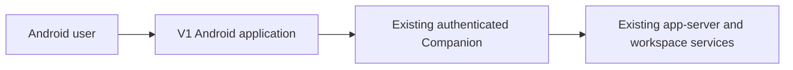
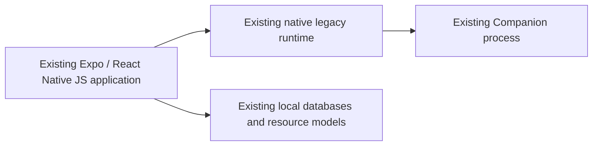

# Android V1 feature architecture

Status: **M0–M8 capability ownership implemented; application-navigation ownership subsequently migrated to Expo Router**. Baseline: `3630ca4ed87a90916bd0a7cb4beaaba230fa28ce`. The source tree below records the M8 feature-extraction checkpoint. Its workspace/navigation entries are historical and are superseded by [V1 route architecture](android-v1-route-architecture.md). Device-only interaction and relative performance remain explicitly unverified. Source paths abbreviated as `data/`, `ui/`, `rendering/` or `features/` are relative to `apps/android/src/`; historical screen line references identify the baseline.

This is the selected V1 capability-ownership entrypoint. Use the [feature migration ledger](android-v1-feature-migration.md) for the historical extraction map and [route architecture](android-v1-route-architecture.md) with its [route ledger](android-v1-route-migration.md) for current application navigation. Use [V1 source context](../apps/android/src/CONTEXT.md) and [runtime/data context](../apps/android/src/data/CONTEXT.md) for local placement rules. The Android V2 frontend is retired; see the [retirement scope and UI audit](android-v2-retirement.md).

## M8 checkpoint subtree: additions and extractions only

The M0-M8 checkpoint created **V1 feature owners** from the former root screen and its scattered feature modules, plus explicit lower owners extracted from `data/use-remote-workspace.ts`. Existing models, databases, native adapters and boot paths stayed at their owners. Existing destinations such as `data/turn-controls-loader.ts` remain in the detailed owner map and are omitted from this historical additions-only tree.

This tree records the implemented M8 additions, extractions and moves before route ownership was migrated. Existing directories appear only as location anchors. **[N]** = new composition/documentation file; **[E]** = extracted behavior at a new path; **[M]** = existing file/family moved with its behavior. The later deletion of `CodeWideScreen`, `WorkspaceScreen`, `WorkspaceOverlays`, `features/navigation/**` and duplicate route wrappers is recorded in the route ledger. On a directory, the source note applies to its children unless a child names another source. Key files are shown here; the migration ledger appendices A–D retain the complete historical symbol, file-family and style mapping.

```text
docs/                                              existing anchor
├── android-v1-feature-architecture.md [N]          selected ownership contract and navigation to local docs
└── android-v1-feature-migration.md [N]             complete move map, lifetime checks, migration and rollback

apps/android/src/                                  existing anchor
├── CONTEXT.md [N]                                 V1 source-placement rules and architecture pointers
├── features/ [N]                                 named V1 interaction owners; no V2 implementation imports
│   ├── workspace/ [E]                            responsive composition ← screen workspace/root bodies
│   │   ├── WorkspaceScreen.tsx                   arranges stable feature surfaces; no feature algorithms
│   │   └── createWorkspaceFeatures.ts [N]         binds narrow capabilities to existing runtime handles
│   ├── navigation/ [E/M]                         destination/activation policy ← screen navigation + data/UI seams
│   │   ├── threadNavigation.ts [M]               selection model ← data/thread-navigation-model.ts
│   │   └── ConversationHost.tsx [M]              retained host ← ui/WorkspaceConversationHost.tsx
│   ├── threadList/ [E/M]                         list scope, paging, filters and identity ← screen sidebar/mobile list
│   │   ├── ThreadListFeature.tsx                 list surface and actions
│   │   ├── threadListModel.ts                    list state and projections extracted from screen
│   │   ├── SidebarSectionHeader.tsx              section view extracted from screen; JSX stays in .tsx
│   │   ├── sidebarRows.ts [M]                    row grouping ← data/sidebar-rows.ts
│   │   ├── summaryProjection.ts [M]              cached projection ← data/thread-list-projection.ts
│   │   └── SidebarListFeedback.tsx [M]           loading/empty/error policy ← ui/SidebarListFeedback.tsx
│   ├── projects/ [E/M]                           project selection/order and new-chat flow ← screen project policy
│   │   ├── ProjectPickerFeature.tsx              project selection surface and directory-choice flow
│   │   ├── ProjectPickerSheet.tsx [M]            picker UI ← ui/ProjectPickerSheet.tsx
│   │   ├── projectSelection.ts                   selected project/pinning interaction
│   │   ├── newChat.ts                            workspace choice and draft-to-thread activation
│   │   ├── newThreadRouting.ts [M]               server-choice policy ← data/new-thread-routing.ts
│   │   ├── SidebarProjects.tsx [M]               management sheet/sections ← ui/SidebarProjects.tsx
│   │   ├── sidebarProjects.ts [M]                public project projection ← data/sidebar-projects.ts
│   │   ├── sidebarProjectOrder.ts [M]            ordering policy ← data/sidebar-project-order.ts
│   │   ├── useSidebarProjectOrder.ts [M]         preference binding ← data/use-sidebar-project-order.ts
│   │   └── useRemoteProjectCatalog.ts [M]        resource demand/retention ← data/use-remote-project-catalog.ts
│   ├── connections/ [E]                          pairing/profile interaction ← screen connection sheets/editors
│   │   ├── ConnectionFeature.tsx                 connection workflow surface
│   │   ├── pairing.ts                            parse/open-session/pairing policy
│   │   ├── connectionPresentation.ts             connection/status display transformations
│   │   └── ConnectionActivityIndicator.tsx        activity view; JSX stays in .tsx
│   ├── settings/ [E/M]                           settings-section composition ← screen + ui/SettingsSheet family
│   │   └── SettingsFeature.tsx                   opens existing security/diagnostics capabilities
│   ├── accounts/ [E/M]                           account/login/usage interaction ← screen + ui usage family
│   │   ├── AccountPoolFeature.tsx                login, explicit cancellation and profile controls
│   │   └── accountUsage.tsx                      usage resource binding and presentation
│   ├── search/ [M]                               search sessions, queries and windows ← current search/ family
│   │   └── GlobalSearchScreen.tsx                global search surface; highlight primitive moves below features
│   ├── conversation/ [E]                         selected-chat reads/rendering ← screen detail + ConversationPane
│   │   ├── ConversationWorkspace.tsx             composes detail, composer and tool capabilities
│   │   ├── ConversationDetail.tsx                restoration boundary and progressive history binding
│   │   ├── timeline/                             viewport, anchors, paging, unread and search-focus policy
│   │   │   └── historyAnchor.ts                  retained session anchor cache extracted from screen
│   │   ├── turns/                                turn activity/streaming/footer rendering
│   │   │   └── turnContexts.tsx                  existing turn-scoped rendering contexts extracted from screen
│   │   ├── protocol/                             dispatch and bounded protocol-content presentation
│   │   │   └── ToolContent.tsx                   tool/JSON/protocol-body rendering kept as one cohesive unit
│   │   └── content/                              full-content viewer and retained request scope
│   │       └── contentViewerContext.ts           viewer request/context extracted from screen
│   ├── composer/ [E/M]                           editor policy ← ConversationPane + existing composer helpers
│   │   ├── ComposerFeature.tsx                   composer surface and scoped action admission
│   │   ├── draft.ts                              persisted draft binding/restoration
│   │   ├── submission.ts                         send/queue/steer admission and failed-send recovery
│   │   ├── deliveryMode.ts [M]                   mode-choice policy ← data/composer-delivery-mode.ts
│   │   ├── settings.ts                           model/effort/permissions and pending control edits
│   │   ├── suggestions.ts                        suggestion interaction
│   │   ├── queueEdit.ts                           separate queued-message editor session
│   │   ├── voice.ts                               current-input binding to retained VoiceInputController
│   │   ├── attachments/                           upload admission, large paste and attachment recovery
│   │   │   └── largePasteCapture.ts [M]           paste helper ← data/composer-paste-attachment.ts
│   │   ├── input/ [M]                             editor implementation ← ui composer-input/helper families
│   │   │   └── ComposerMarkdownInput.*            existing native/web/type siblings move together
│   │   └── skills/ [M]                            skill picker/suggestions ← ui/SkillsPicker and related helpers
│   ├── queue/ [E/M]                               queue list/control policy ← screen queue + ui/InlineQueueOverlay
│   │   ├── QueueFeature.tsx                       queue surface; edit intent goes to composer
│   │   └── queueActions.ts                        cancel/move/steer controls
│   ├── requests/ [E/M]                            approval/input forms ← screen prompts + data/elicitation-form
│   │   ├── RequestFeature.tsx                     pending-request surface
│   │   └── requestResponse.ts                     validation, response pending and rejection
│   ├── goal/ [E/M]                                goal interaction ← screen dialog + existing goal helper/chip
│   │   ├── GoalFeature.tsx                        goal read/set/clear surface
│   │   └── goalEditor.ts [M]                      editor policy ← data/goal-editor.ts
│   ├── turnActions/ [E/M]                         shared thread actions ← screen handlers + rename dialog
│   │   ├── ThreadActions.tsx                      header/list action surface
│   │   └── turnActions.ts                         rename/archive/pin/read/fork/interrupt/compact policy
│   ├── attachments/ [E]                           viewer/annotation interaction ← ConversationPane resources
│   │   ├── AttachmentsFeature.tsx                 attachment list and opening capabilities
│   │   ├── documentNavigation.ts                  document stack/session policy
│   │   └── attachmentPreview.tsx                  private image/video/document opening and annotation intent
│   ├── changes/ [E]                               change selection/preferences ← screen resource/change bodies
│   │   ├── ChangesFeature.tsx                     session/turn changes surface
│   │   └── changePresentation.ts                  scope/diff/source preferences and recorded-turn changes
│   ├── review/ [E/M]                              review interaction ← screen review + CodeReviewWorkspace
│   │   ├── ReviewFeature.tsx                      review session surface
│   │   ├── comments/                              line comment, voice and attachment serialization owners
│   │   ├── editor/                                native/web editor adapters and typed bridge
│   │   │   └── webview/                           browser-only Pierre entry, patch adapter and HTML source
│   │   ├── resources/                             changed-file projection, loading and path policy
│   │   └── workspace/                             CodeReviewWorkspace composition and view state
│   ├── drawing/ [E/M]                             drawing/annotation interaction ← screen + ui/DrawingWorkspace
│   │   ├── DrawingFeature.tsx                     drawing session and accepted-close flow
│   │   └── drawingAttachment.ts                   snapshot/PNG conversion and result handoff
│   ├── agents/ [E/M]                              subagent interaction ← screen + ui/SubagentSheet/Workspace
│   │   ├── AgentsFeature.tsx                      list and child conversation detail surface
│   │   └── agentSelection.ts                      scoped selection using existing subagent Transition
│   ├── terminal/ [E/M]                            terminal UI lifecycle ← screen + ui/TerminalWorkspace
│   │   ├── TerminalFeature.tsx                    tabs and explicit open/close over retained native store
│   │   └── backgroundTerminals.tsx                background process list/termination
│   ├── ports/ [E/M]                               forwarding and tunnel interaction
│   │   ├── PortsFeature.tsx                       create/revoke tunnel and invoke injected browser capability
│   │   └── loopbackNavigation.ts                  qualify and start forwards before browser handoff
│   ├── browser/ [E/M]                             standalone in-app browser and feedback interaction
│   │   ├── BrowserWorkspace.tsx           fullscreen browser surface
│   │   ├── InternalBrowser.native.tsx             WebView navigation and DevTools composition
│   │   └── feedbackSubmission.ts                  narrow feedback delivery capability
│   └── diagnostics/ [E/M]                         diagnostics UI ← screen recovery + ui/PerformanceDiagnostics
│       ├── DiagnosticsFeature.tsx                 diagnostic/experiment surface
│       └── renderRecovery.ts                      recovery-thread action; metrics remain below UI
├── data/                                          existing anchor; the following owners are extracted, not new runtimes
│   ├── CONTEXT.md [N]                             lower ownership and forbidden feature dependencies
│   ├── workspace-runtime.ts [E]                   JS startup/handles/subscriptions ← use-remote-workspace.ts
│   ├── workspace-session.ts [E]                   HTTP session/mint/attach authority ← same facade
│   ├── connection-runtime.ts [E]                  profile/credential/timing behavior ← same facade
│   ├── catalog-runtime.ts [E]                     catalog/subagent freshness, repair and retention ← same facade
│   ├── thread-sync-runtime.ts [E]                 history authority, observer/read/reconciliation lanes ← same facade
│   ├── thread-resource-loader.ts [E]              shared resource reads/merge/deduplication ← same facade
│   ├── thread-ui-state-initialization.ts [E]       one shared draft/preferences/scroll seed operation ← same facade
│   ├── account-rate-limits-loader.ts [E]           explicit + automatic usage-read deduplication ← same facade
│   ├── command-delivery.ts [E]                    existing optimistic mutation/receipt boundary ← same facade
│   └── voice-transport.ts [E]                     dictation retries/abort/finish transport ← same facade
├── ui/                                            existing anchor; only extracted reusable views shown
│   ├── MenuAction.tsx [E]                         shared menu interaction ← screen MenuAction
│   ├── ControlOption.tsx [E]                      shared control option ← screen ControlOption
│   ├── ResourceContextChip.tsx [E]                context label/count layout ← screen composer context helpers
│   └── ThreadTitle.tsx [E]                        shared title/emoji rendering ← screen title helpers
└── rendering/                                     existing anchor; only moved shared primitive shown
    └── SearchMessageFocus.tsx [M]                 highlight context ← search/SearchMessageFocus.tsx
```

Feature command adapters (`workspaceAdapter.ts` where the mapped feature needs one), local styles and local `CONTEXT.md` contracts belong inside their owning feature. The complete migration maps determine them; the tree does not require an identical set of files in every folder. Platform families retain all existing native/web/type siblings. Local feature documentation appears with the actual migration unit, never as empty scaffolding in the documentation phase.

## Architecture Decision: structural feature ownership

Create named V1 feature zones under `src/features/`. Colocate feature interaction models, resource coordination, action policy, UI and styles. Keep meaningful submodules inside large features, especially composer and conversation. Retain existing deep database, resource, native and protocol mechanisms at their established owners. Features consume narrow capabilities rather than `RemoteWorkspace`.

The **feature-facing** `useRemoteWorkspace` aggregation is a temporary migration surface and disappears at closure. Its JS module-started singleton/session/database lifecycle remains an internal runtime mechanism, distinct from the boot-controlled native handle; it is not replaced by a new service graph. Feature-specific action adapters and request caches leave the omnibus implementation, but native/protocol authority and durable model write lanes stay the same. This distinguishes the selected change from the radical option.

No dependency-injection container is needed. Ordinary functions bind stable model handles and callbacks once per existing owner lifetime. No global context carries all features or mirrors server data.

The decision addresses unrelated interaction policies concentrated in the 18,792-line screen and its broad runtime facade. Component-only moves do not close ownership; replacing the whole runtime lifecycle is unnecessary for this target. No new domain model, process, service, event bus, DI container or generic feature framework is introduced. These are responsibility zones; strategic/tactical DDD artifacts are not needed because entity identity and schema authority remain unchanged.

## Approved Global Supervisor extension

Status: **implemented source contract; physical-device WebRTC proof is pending**. This extension is additive to the implemented M0–M8 ownership model. It does not reopen the earlier migration or change V2.

Global Voice Mode is an explicitly toggled, process-lifetime V1 feature backed by one ordinary App Server thread on a selected home `connectionId`. It remains active across application navigation and backgrounding until explicit Stop or terminal failure. The App Server remains the transcript authority. Companion excludes reserved supervisor sources from ordinary active, archived, search, project and aggregate-count surfaces; ordinary thread sync rejects these identities. Device binding state is not a presentation classifier. Private recovery uses the exact-source `companion/supervisor/threadList` endpoint. A title or other display metadata is never a classifier. An unresolved create is reconciled by its exact creation token; it must not automatically issue another `thread/start`.

V1 settings expose one `Voice Assistant` page with separate device-wide voice, orb-style, personality and experimental microphone-filter contracts. Personality is presented as one unlabeled freeform field; the versioned storage profile still reads its former communication-style and rules fields for compatibility and clears them on the next explicit save. Audio-input routing remains a native runtime concern and has no settings UI. The existing `global-voice` record remains readable so upgrades preserve the selected audio voice; absence of the versioned personality record preserves the previous supervisor instructions. The current personality snapshot is composed with the fixed capability instructions both when a hidden thread is created and for every `realtimeStartInstructions` request, including existing hidden threads. A running activation is immutable with respect to settings changes; saved changes apply on the next explicit activation.

The public feature surface is one composition factory, one stable model-owned render resource, one app-level `toggle`, and internal `enter`, `start`, `stop` plus typed recovery actions. Every action keeps the V1 `() => void | Promise<void>` contract. The hidden supervisor is an ordinary Codex thread and retains the built-in tools, skills, MCP servers, plugins and approval policy supplied by its home App Server. Cross-chat operations accept only a `QualifiedChatRef` containing both `connectionId` and `threadId`; CodeWide adds six dynamic tools: `createChat`, `listChats`, `readChat`, `followChat`, `sendText` and `unfollowChat`. Created workers remain ordinary visible top-level Codex chats. Reads use authoritative App Server history; sends reuse the existing durable command-delivery and receipt path with a content-free request-derived idempotency identity. No generic CodeWide RPC tool, second outbox, optimistic supervisor message or parallel transcript store is introduced.

The supervisor thread remains the orchestration and reporting context. Brief actions may run inline; substantial, long-running, noisy, specialized or parallel work is delegated into separate visible top-level chats through `createChat`, while existing relevant chats are enrolled through `followChat` or implicitly by `sendText`. Workers receive concrete objectives and return distilled progress/results so execution traces do not consume the supervisor context. Ordinary subagents remain available for bounded internal implementation details but are not the owner of the cross-chat notification relation.

### Worker attention decision

The option space was evaluated before implementation:

- **Incremental — active-only completion callback: FAIL.** It is cheap, but races activation startup/reconnect, cannot preserve qualified relation and replay-deduplication state, and cannot provide durable acknowledgement.
- **Structural — Android attention projection over the existing Companion journal: PASS.** App Server thread events retain their existing ordered at-least-once transport. One Android data owner persists qualified supervisor/worker relations, projects only important transitions, deduplicates by stable event identity and commits before the source cursor is acknowledged.
- **Radical — supervisor-specific broker inside Companion: FAIL for this scope.** It could centralize delivery later, but today it would move product policy below its owner, complicate cross-connection aggregation and enlarge the privacy boundary. The cheapest future experiment is a relay-only prototype that forwards the same typed envelopes without owning relation semantics.

`createChat` persists a creation relation before `thread/start`; `thread/started` or snapshot reconciliation converts it to an exact qualified relation without polling. `followChat` and `sendText` persist an active relation; `unfollowChat` and worker close/archive/delete stop future projection. Relations and attention rows are partitioned by both supervisor and worker connection/thread identity, so multiple supervisor sessions and equal thread ids on different connections cannot cross-deliver.

Only terminal turn completion with a bounded preview, failed/interrupted turns, blocked/system-error states, and pending user decision/approval become attention events. Full transcripts and tool output remain behind explicit `readChat`. Multiple active-session events are ordered by source time then stable event id, stored independently, delivered at least once and acknowledged idempotently. Events observed while Global Voice is off are stored already acknowledged as replay tombstones. Resolved pending requests are retired from the inbox. Reconnect/restart replay cannot recreate an acknowledged row.

The relation and deduplication store exists independently of voice activation, while the pending inbox is activation-scoped. Enable atomically acknowledges any inactive backlog before new events may become pending; disable acknowledges the remaining queue before transport cleanup. While voice is active, one event at a time is appended as untrusted developer context only when speech is idle; the next event waits for the assistant response to finish. The live delivery queue never interrupts an utterance, and there is no timer or hidden polling loop.

### Owned modules and dependency direction

- `features/globalSupervisor/**` owns binding/capability/activation presentation state, user actions, route-ready composition and the transient active transcript/activity view. Its nearest ownership contract is [`apps/android/src/features/globalSupervisor/CONTEXT.md`](../apps/android/src/features/globalSupervisor/CONTEXT.md).
- `data/globalSupervisorBinding*`, `data/globalSupervisorToolTarget*`, `data/globalSupervisorThread*`, `data/globalSupervisorTools*`, `data/globalSupervisorToolRouter*`, `data/globalSupervisorAttention*`, `data/globalSupervisorEventSignals*` and `data/globalSupervisorRuntime*` own persistence and validated adapters. They do not import feature UI or routes.
- The neutral process-lifetime V1 microphone lease owner is lower than both dictation and Global Voice Mode. It grants a generation-fenced lease for purpose `dictation` or `globalSupervisor`; a busy acquire rejects without stopping the incumbent, and stale release cannot stop a later capture.
- The Android WebRTC adapter owns the peer connection, microphone/output media tracks, Android microphone foreground-service token, SDP application and media teardown behind the matching lease. It owns no App Server RPC, binding or transcript. Companion carries only the SDP/control plane; audio never becomes JSON or enters the authenticated sync socket.
- Companion owns only the closed realtime-method classifier, authenticated live-channel correlation and bounds, the closed pending-request classifier, and durable server-response correlation. It owns no supervisor tool names or UI policy.
- Existing catalog/history/session/delivery/user-request owners remain authoritative and must not import the feature. V1 continues to exclude `src/v2/**`, `@codewide/sync-client/v2` and V2 storage.

The live-only Companion-to-native channel shares the authenticated sync socket but is diverted before Companion `ordered_ingest` and before Android's generic event branch. `liveSubscribe` binds a random content-free channel id and exact supervisor thread to the issuing socket; `liveEvent` carries a channel-local monotonic sequence; `liveOverflow`, unsubscribe, socket loss or terminal realtime close destroys the channel. Realtime notifications never enter Companion replay, `IndexStore`, `NativeFrameStore`, checkpoint JSON or inactive delivery. There is no cursor, catch-up or replay. A gap, stale channel, thread mismatch, repeated/out-of-order sequence, event outside the active session or bound breach terminates the activation instead of guessing.

Pending requests use one closed classification. The existing five approval/input methods are `userInteraction`; only `item/tool/call` is `systemDynamicTool`. Both classes may use the existing generic Companion/native pending-request persistence, but JS fans them out to disjoint consumers. `PendingRequestDatabase` and approval UI continue to admit only `userInteraction`. The in-memory supervisor router accepts `systemDynamicTool` only for the ready binding's exact home connection and supervisor thread; every other dynamic tool fails closed. Resolution continues through the existing durable `serverRequest/resolved` path.

### Schema-owned correctness limits

`crates/companion-core/contract/v1.json` is the sole machine-readable owner of `globalSupervisorLimitsV1`, whose discriminator is `version: 1`. Generated/shared Rust, Kotlin and TypeScript surfaces consume exactly these values. Product modules may tighten private operating targets but must not restate or relax these maxima. A stricter pinned protocol cap wins; relaxing any value requires `GlobalSupervisorLimitsV2`.

| Field                                |        V1 value | Boundary behavior                                                                                  |
| ------------------------------------ | --------------: | -------------------------------------------------------------------------------------------------- |
| `liveChannelMaxEnvelopes`            |             256 | terminate before envelope 257 is queued                                                            |
| `liveChannelMaxBytes`                | 4,194,304 bytes | terminate before queued bytes exceed the cap                                                       |
| `liveEnvelopeMaxBytes`               |   262,144 bytes | reject and terminate before queueing or native emission                                            |
| `microphoneInputBufferMaxDurationMs` |        2,000 ms | reserved compatibility cap for the removed WebSocket PCM path; WebRTC does not allocate this queue |
| `microphoneInputBufferMaxBytes`      |   262,144 bytes | reserved compatibility cap for the removed WebSocket PCM path; WebRTC does not allocate this queue |
| `outputPlaybackBufferMaxDurationMs`  |        5,000 ms | reserved compatibility cap for the removed WebSocket PCM path; WebRTC does not allocate this queue |
| `outputPlaybackBufferMaxBytes`       |   524,288 bytes | reserved compatibility cap for the removed WebSocket PCM path; WebRTC does not allocate this queue |
| `dynamicToolInputMaxBytes`           |    65,536 bytes | fixed bounded failure before Android persistence/dispatch                                          |
| `dynamicToolOutputMaxBytes`          |   262,144 bytes | replace an oversized result with a fixed bounded failure                                           |
| `listChatsPageMaxEntries`            |     100 entries | bounded page plus opaque continuation                                                              |
| `readChatPageMaxItems`               |       100 items | stop at the first item/byte cap and return continuation                                            |
| `readChatPageMaxBytes`               |   262,144 bytes | stop at the first item/byte cap and return continuation                                            |
| `eventCoalescingMaxDistinctSources`  |      32 sources | coalesce repeats and drop later distinct sources in-window                                         |
| `eventCoalescingWindowMs`            |        2,000 ms | reset the distinct-source window                                                                   |
| `realtimeStartupTimeoutMs`           |       15,000 ms | terminate activation and release channel/lease                                                     |
| `interruptionAckTimeoutMs`           |        2,000 ms | reserved compatibility bound; terminal WebRTC state tears down the activation directly             |
| `realtimeStopCloseTimeoutMs`         |        5,000 ms | force local teardown and unsubscribe without `closed`                                              |

All limits are enforced before the next copy, queue insertion, persistence, materialization or emission. Queue owners maintain incremental totals; list/read stop without materializing the remainder. The first cap reached wins for dual duration/byte bounds. No over-limit path spills to another queue, persists partial realtime media or retries with an unbounded representation.

### Composition and validation contract

Global Voice has no application route or dedicated screen. `WorkspaceRouteComposition` obtains the already-created `GlobalSupervisorFeatureContract` from `createWorkspaceFeatures`, derives only the boolean active projection and passes `{ active, onToggle }` into both persistent thread-list headers. The inactive live-assistant signal starts or recovers the supervisor; the active stop icon ends it. Navigation, Back, route unmount and app backgrounding never call cleanup. The control performs no RPC, SQLite, filesystem or native reads. Escaping callbacks use `useEvent`; no `useCallback` or `useMemo` is added.

Validation is a release gate, not an implementation suggestion:

| Contract                    | Required evidence                                                                                                                                                                                 |
| --------------------------- | ------------------------------------------------------------------------------------------------------------------------------------------------------------------------------------------------- |
| binding and hiding          | crash-point reconciliation plus active/archive/search/project/count/default/direct-route exclusion while authoritative history remains readable                                                   |
| schema parity and bounds    | Rust/Kotlin/TypeScript parity plus at-limit and one-over tests for all 17 fields, including earlier-wins dual caps                                                                                |
| live-only transport         | sequence/overflow/reconnect tests and negative inspection of Companion replay, `IndexStore`, `NativeFrameStore`, checkpoints and inactive delivery                                                |
| request classification      | method-class matrix, hello/reconnect retention, disjoint JS consumers, durable resolution removal and unchanged five user methods                                                                 |
| tool execution              | validation/pagination tests and replay proof of one target `turn/start` plus one response for `sendText`                                                                                          |
| microphone/audio            | busy and stale-token rejection, dictation parity, permission/interruption handling, background continuation, explicit teardown, SDP answer application and physical-device headset/media evidence |
| activation and presentation | state-machine tests for every declared state/recovery, one-button start/stop settlement, active accessibility state, absence of a route and forbidden component dependencies                      |
| pinned App Server substrate | disposable-thread proof for exact tools, resume, realtime voice probe/V3 WebRTC audio, interruption/close/reconnect, zero journal bytes and readable history                                      |
| integrated V1               | focused owner tests followed by `pnpm validate:android:v1`; no hygiene-baseline expansion or bypassed gate                                                                                        |

Failure of the pinned realtime/tool proof, any journal persistence, duplicate supervisor creation/send, hidden-thread leakage, request-class crossover, capture preemption/stale release or continued audio after terminal state blocks approval. Publishing is outside this architecture slice.

## Context and containers

These views describe retained runtime boundaries; they do not add containers.





## Module view and ports/adapters

Inbound feature ports are public interaction methods and surfaces: select/open/edit/submit intents with qualified V1 scope. Outbound ports are the narrow model-owned read resources and command capabilities actually required by each feature. Concrete adapters use existing native/web transport, database and controller contracts; no generic RPC capability crosses into feature consumers. The diagram distinguishes source composition from the two current startup entrypoints.

Commands cross feature boundaries as narrow methods with current qualified V1 scope, original completion and rejection behavior. Reads expose existing stable model-owned resources/selectors. A feature never receives the whole `RemoteWorkspace`, arbitrary `rpc(method, payload)` or all database handles merely for convenience.

Feature application code owns admission, UI pending/recovery and transformation policy; a feature's `workspaceAdapter.ts` owns conversion between its capability and existing session/model operations. The adapter does not own reconnect or durable publication authority. Data/native own transport/persistence correctness. Features do not import each other's adapters or private models.

Direct Expo/native operations already present in the screen move with their actual feature policy into its platform/synchronization module, not into root composition. Reuse existing native/web adapters where they vary. A new universal Clipboard/Camera/Clock abstraction is not required merely to move the caller; no one-port directory is introduced without real owned policy.

```mermaid
flowchart TB
  Route[app/(workspace)/_layout.tsx] --> Root[WorkspaceRouteComposition]
  Import[V1 route composition module evaluation] --> Runtime[Retained JS workspace singleton startup and handles]
  Effect[app/(workspace)/_layout.tsx activation effect] --> Slot[Boot slot: native resource handle]
  Slot --> Native[Native transport and platform contracts]
  Root --> Runtime
  Root --> WS[Workspace composition]
  WS --> Nav[Navigation and selected destination]
  WS --> Lists[Thread list, projects, connections, settings, accounts, search]
  WS --> Conv[ConversationWorkspace composition]
  Conv --> Detail[ConversationDetail / timeline / turns]
  Conv --> Composer[Composer / queue editor / voice binding / upload admission]
  Conv --> Tools[Queue, requests, goal, turn actions, media, changes, review, drawing, agents, terminal, ports]
  Tools --> Detail
  Lists --> Caps[Feature public capabilities and stable resources]
  Composer --> Caps
  Detail --> Caps
  Tools --> Caps
  Caps --> Adapters[Feature operation adapters]
  Adapters --> Runtime
  Runtime --> Models[Existing model and database owners]
  Runtime --> Native[Native transport and platform contracts]
  Native --> Sync[V1 Companion and sync-client]
  Detail --> Rendering[Protocol-neutral / generic rendering primitives]
  Tools --> Rendering
```

The diagram shows runtime calls, not a license to import a downstream implementation through its runtime caller. Dependency inversion is explicit: capability contracts live with their consumer owner; runtime composition binds adapter implementations; lower data/native modules import **no feature contracts or code**. A feature adapter can import lower data contracts. `Tools -> Detail` is specifically the agents read-only child surface; other tools need no conversation import. Root passes feature-produced UI/outcome capabilities without implementing their policy.

Binding imports:

- All V1, including type imports: must not import `src/v2/**`, `@codewide/sync-client/v2` or V2 storage.
- `src/data/**`, `src/native/**`, package protocol/sync owners: must not import `src/features/**` or route composition.
- Feature internals: must not import root route composition, another feature's private model/adapter/style, or the temporary `use-remote-workspace` facade after that feature's migration closes.
- `features/conversation/{timeline,turns,protocol,content}` and `ConversationDetail`: must not import `ConversationWorkspace`, `features/agents`, `features/composer` or sibling tool implementations. Compose injected callbacks at the outer surface.
- `features/composer`: must not import queue's private model, review/drawing/ports/terminal internals, or navigate directly. It exposes typed intents and attachment/editor capabilities to its outer composition.
- `features/agents`: may import only the public conversation detail/read surface and navigation capabilities, never full `ConversationWorkspace`.
- `src/presentation/**`: retains its current complete ban on V1/V2 runtime/model/store/I/O imports. Generic ui/rendering primitives cannot import feature modules; feature-specific old UI/rendering modules must move or become injected, not create back-edges.
- No cycles, unresolved imports, broad barrels, generic RPC capability or omitted type edges. Encode exact allowed public entry modules in Dependency Cruiser; do not exempt the whole features tree.

## Preserved V1 contracts

1. Main-chat navigation publishes selection immediately, then shows cached content/local skeleton and progressive transcript; composer restoration precedes editing. Header/composer do not wait for all history. Subagent selection retains its existing Transition. Evidence: screen 1128–1204, 1973–2026 and `test/conversation-transition-parity.test.ts`. The V1-specific rule in [AGENTS.md](../AGENTS.md#android-v1-feature-boundary) records this contract.
2. The native conversation shell remains mounted across selected chats. `useConversationState` resets before commit and blocks old-owner setters; `useConversationOwner` distinguishes same-scope remounts. Moving these into a latest-value callback changes their contract.
3. Data loading remains model/resource-owned and begins from stable resource reads or explicit intent, never a fetch effect. Retention effects only retain/release established resources.
4. Resource keys, revisions, Promise identity, cache limits, request deduplication, source witnesses, authority checks and publication order are unchanged.
5. Send preserves current V1 behavior: compute send/queue/steer once, accept durable command ownership below UI, clear draft locally, recover only the failed pre-ownership submission into its correct draft, never create a second optimistic item and never move the resident history window from Send.
6. Queue-edit uploads retain their `queue-edit:<commandId>` scope; voice captures the correct input binding and explicit final transcript; late completions never mutate another activation.
7. Preserve list/turn identities, WeakMap caches, bounded output, disclosure retention, window anchors, pagination edge lock, tail following, measured list sizes and native reveal. Do not clone the message graph or recreate caches inside render.
8. Do not copy V2 Action/operation/epoch contracts, generic framework layers or source modules. V1 type imports remain acyclic and generation-isolated.
9. Preserve explicit rejection and platform capability behavior. This migration does not expand browser transport support or tighten unrelated input limits.
10. No broad suppressions, formatter sweep, blanket type redesign or test weakening. Existing unrelated defects are not silently corrected during moves.

The JS module singleton starts during module evaluation. The legacy route/boot handle separately starts and stops native resources. Preserve their exact entrypoints and current teardown limits; the [runtime field closure](../apps/android/src/data/CONTEXT.md#current-startup-and-complete-runtime-state-closure) assigns all 31 properties, ten snapshot slots and shared UI-state initialization. Feature mounts never create replacement caches or a new runtime.

## Contract routing and completion

- [Migration ledger](android-v1-feature-migration.md): entity delta, all 22 owners, methods, lifetimes, source/proof maps, M0–M8 acceptance and rollback. M0–M8 are implemented; final available validation and device limits are recorded there.
- [Quality checks](android-v1-quality-migration.md): current enforced gates and planned feature-path coverage; every application unit runs `pnpm validate:android:v1`.
- [TypeScript environments](android-typescript-environments.md): native/web/compatibility contracts.
- [History pagination](history-pagination.md), [scroll performance](scroll-performance.md), [native markup](native-message-markup.md) and [native row rendering](native-row-rendering.md): detailed mechanisms retained rather than duplicated here.

`src/routeComposition/WorkspaceRouteComposition.tsx` is the current route composition entry. Feature-local CONTEXT files appear with real implementation modules. Closure requires deleting moved private declarations/styles, migrating all consumers and the broad facade, preserving platform families, and passing the ownership and parity gates. Documentation approval is not application migration, commit, push or release authorization.
