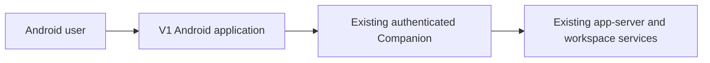
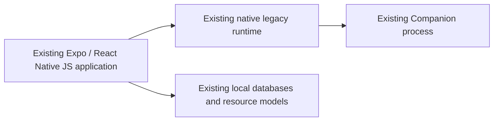
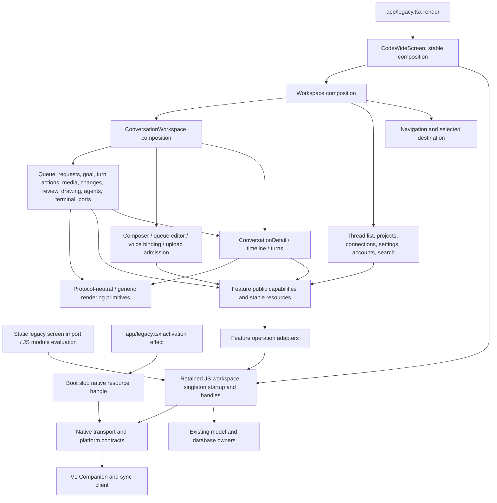

# Android V1 feature architecture

Status: **M0–M8 source ownership implemented; final validation recorded in the migration ledger**. Baseline: `3630ca4ed87a90916bd0a7cb4beaaba230fa28ce`. All 22 feature owners, lower runtime closure and facade deletion are implemented. Device-only interaction and relative performance remain explicitly unverified. Source paths abbreviated as `data/`, `ui/`, `rendering/` or `features/` are relative to `apps/android/src/`; historical screen line references identify the baseline.

This is the selected V1 architecture entrypoint. Use the [migration ledger](android-v1-feature-migration.md) for complete source ownership, lifetimes, compatibility, tests and bounded migration units; use [V1 source context](../apps/android/src/CONTEXT.md) and [runtime/data context](../apps/android/src/data/CONTEXT.md) for local placement rules. Existing [V2 architecture](android-v2-client-architecture.md) remains a separate contract.

## Target subtree: additions and extractions only

The change creates **V1 feature owners** from `CodeWideScreen.tsx` and its scattered feature modules, plus explicit lower owners extracted from `data/use-remote-workspace.ts`. Existing models, databases, native adapters and boot paths stay at their current owners. Existing destinations such as `data/turn-controls-loader.ts` remain in the detailed owner map and are omitted from this additions-only tree.

This tree records the implemented additions, extractions and moves. Existing directories appear only as location anchors. **[N]** = new composition/documentation file; **[E]** = extracted behavior at a new path; **[M]** = existing file/family moved with its behavior. Source targets are implemented. The four documentation files marked [N] originated in D0. On a directory, the source note applies to its children unless a child names another source. Key files are shown here; the migration ledger appendices A–D retain the complete symbol, file-family and style mapping. No unlisted generic layer or scaffold is implied.

```text
docs/                                              existing anchor
├── android-v1-feature-architecture.md [N]          selected ownership contract and navigation to local docs
└── android-v1-feature-migration.md [N]             complete move map, lifetime checks, migration and rollback

apps/android/src/                                  existing anchor
├── CONTEXT.md [N]                                 V1 source-placement rules and architecture pointers
├── features/ [N]                                 named V1 interaction owners; no V2 implementation imports
│   ├── workspace/ [E]                            responsive composition ← screen workspace/root bodies
│   │   ├── WorkspaceScreen.tsx                   arranges stable feature surfaces; no feature algorithms
│   │   └── createWorkspaceFeatures.ts [N]         binds narrow capabilities to existing runtime handles
│   ├── navigation/ [E/M]                         destination/activation policy ← screen navigation + data/UI seams
│   │   ├── threadNavigation.ts [M]               selection model ← data/thread-navigation-model.ts
│   │   └── ConversationHost.tsx [M]              retained host ← ui/WorkspaceConversationHost.tsx
│   ├── threadList/ [E/M]                         list scope, paging, filters and identity ← screen sidebar/mobile list
│   │   ├── ThreadListFeature.tsx                 list surface and actions
│   │   ├── threadListModel.ts                    list state and projections extracted from screen
│   │   ├── SidebarSectionHeader.tsx              section view extracted from screen; JSX stays in .tsx
│   │   ├── sidebarRows.ts [M]                    row grouping ← data/sidebar-rows.ts
│   │   ├── summaryProjection.ts [M]              cached projection ← data/thread-list-projection.ts
│   │   └── SidebarListFeedback.tsx [M]           loading/empty/error policy ← ui/SidebarListFeedback.tsx
│   ├── projects/ [E/M]                           project selection/order and new-chat flow ← screen project policy
│   │   ├── ProjectPickerFeature.tsx              project selection surface and directory-choice flow
│   │   ├── ProjectPickerSheet.tsx [M]            picker UI ← ui/ProjectPickerSheet.tsx
│   │   ├── projectSelection.ts                   selected project/pinning interaction
│   │   ├── newChat.ts                            workspace choice and draft-to-thread activation
│   │   ├── newThreadRouting.ts [M]               server-choice policy ← data/new-thread-routing.ts
│   │   ├── SidebarProjects.tsx [M]               management sheet/sections ← ui/SidebarProjects.tsx
│   │   ├── sidebarProjects.ts [M]                public project projection ← data/sidebar-projects.ts
│   │   ├── sidebarProjectOrder.ts [M]            ordering policy ← data/sidebar-project-order.ts
│   │   ├── useSidebarProjectOrder.ts [M]         preference binding ← data/use-sidebar-project-order.ts
│   │   └── useRemoteProjectCatalog.ts [M]        resource demand/retention ← data/use-remote-project-catalog.ts
│   ├── connections/ [E]                          pairing/profile interaction ← screen connection sheets/editors
│   │   ├── ConnectionFeature.tsx                 connection workflow surface
│   │   ├── pairing.ts                            parse/open-session/pairing policy
│   │   ├── connectionPresentation.ts             connection/status display transformations
│   │   └── ConnectionActivityIndicator.tsx        activity view; JSX stays in .tsx
│   ├── settings/ [E/M]                           settings-section composition ← screen + ui/SettingsSheet family
│   │   └── SettingsFeature.tsx                   opens existing security/generation capabilities
│   ├── accounts/ [E/M]                           account/login/usage interaction ← screen + ui usage family
│   │   ├── AccountPoolFeature.tsx                login, explicit cancellation and profile controls
│   │   └── accountUsage.tsx                      usage resource binding and presentation
│   ├── search/ [M]                               search sessions, queries and windows ← current search/ family
│   │   └── GlobalSearchScreen.tsx                global search surface; highlight primitive moves below features
│   ├── conversation/ [E]                         selected-chat reads/rendering ← screen detail + ConversationPane
│   │   ├── ConversationWorkspace.tsx             composes detail, composer and tool capabilities
│   │   ├── ConversationDetail.tsx                restoration boundary and progressive history binding
│   │   ├── timeline/                             viewport, anchors, paging, unread and search-focus policy
│   │   │   └── historyAnchor.ts                  retained session anchor cache extracted from screen
│   │   ├── turns/                                turn activity/streaming/footer rendering
│   │   │   └── turnContexts.tsx                  existing turn-scoped rendering contexts extracted from screen
│   │   ├── protocol/                             dispatch and bounded protocol-content presentation
│   │   │   └── ToolContent.tsx                   tool/JSON/protocol-body rendering kept as one cohesive unit
│   │   └── content/                              full-content viewer and retained request scope
│   │       └── contentViewerContext.ts           viewer request/context extracted from screen
│   ├── composer/ [E/M]                           editor policy ← ConversationPane + existing composer helpers
│   │   ├── ComposerFeature.tsx                   composer surface and scoped action admission
│   │   ├── draft.ts                              persisted draft binding/restoration
│   │   ├── submission.ts                         send/queue/steer admission and failed-send recovery
│   │   ├── deliveryMode.ts [M]                   mode-choice policy ← data/composer-delivery-mode.ts
│   │   ├── settings.ts                           model/effort/permissions and pending control edits
│   │   ├── suggestions.ts                        suggestion interaction
│   │   ├── queueEdit.ts                           separate queued-message editor session
│   │   ├── voice.ts                               current-input binding to retained VoiceInputController
│   │   ├── attachments/                           upload admission, large paste and attachment recovery
│   │   │   └── largePasteCapture.ts [M]           paste helper ← data/composer-paste-attachment.ts
│   │   ├── input/ [M]                             editor implementation ← ui composer-input/helper families
│   │   │   └── ComposerMarkdownInput.*            existing native/web/type siblings move together
│   │   └── skills/ [M]                            skill picker/suggestions ← ui/SkillsPicker and related helpers
│   ├── queue/ [E/M]                               queue list/control policy ← screen queue + ui/InlineQueueOverlay
│   │   ├── QueueFeature.tsx                       queue surface; edit intent goes to composer
│   │   └── queueActions.ts                        cancel/move/steer controls
│   ├── requests/ [E/M]                            approval/input forms ← screen prompts + data/elicitation-form
│   │   ├── RequestFeature.tsx                     pending-request surface
│   │   └── requestResponse.ts                     validation, response pending and rejection
│   ├── goal/ [E/M]                                goal interaction ← screen dialog + existing goal helper/chip
│   │   ├── GoalFeature.tsx                        goal read/set/clear surface
│   │   └── goalEditor.ts [M]                      editor policy ← data/goal-editor.ts
│   ├── turnActions/ [E/M]                         shared thread actions ← screen handlers + rename dialog
│   │   ├── ThreadActions.tsx                      header/list action surface
│   │   └── turnActions.ts                         rename/archive/pin/read/fork/interrupt/compact policy
│   ├── attachments/ [E]                           viewer/annotation interaction ← ConversationPane resources
│   │   ├── AttachmentsFeature.tsx                 attachment list and opening capabilities
│   │   ├── documentNavigation.ts                  document stack/session policy
│   │   └── attachmentPreview.tsx                  private image/video/document opening and annotation intent
│   ├── changes/ [E]                               change selection/preferences ← screen resource/change bodies
│   │   ├── ChangesFeature.tsx                     session/turn changes surface
│   │   └── changePresentation.ts                  scope/diff/source preferences and recorded-turn changes
│   ├── review/ [E/M]                              review interaction ← screen review + CodeReviewWorkspace
│   │   ├── ReviewFeature.tsx                      review session surface
│   │   ├── reviewSubmission.ts                    serialize/submit result; composer admits attachment
│   │   └── CodeReviewWorkspace.tsx [M]            workspace ← rendering/CodeReviewWorkspace.tsx
│   ├── drawing/ [E/M]                             drawing/annotation interaction ← screen + ui/DrawingWorkspace
│   │   ├── DrawingFeature.tsx                     drawing session and accepted-close flow
│   │   └── drawingAttachment.ts                   snapshot/PNG conversion and result handoff
│   ├── agents/ [E/M]                              subagent interaction ← screen + ui/SubagentSheet/Workspace
│   │   ├── AgentsFeature.tsx                      list and child conversation detail surface
│   │   └── agentSelection.ts                      scoped selection using existing subagent Transition
│   ├── terminal/ [E/M]                            terminal UI lifecycle ← screen + ui/TerminalWorkspace
│   │   ├── TerminalFeature.tsx                    tabs and explicit open/close over retained native store
│   │   └── backgroundTerminals.tsx                background process list/termination
│   ├── ports/ [E/M]                               forwarding/browser interaction ← screen + ui forwarding/browser
│   │   ├── PortsFeature.tsx                       create/revoke/open tunnel capabilities
│   │   ├── browserNavigation.ts                   loopback opening and browser session policy
│   │   └── browser/ [M]                           existing browser/ family + ui/InternalBrowser platform family
│   └── diagnostics/ [E/M]                         diagnostics UI ← screen recovery + ui/PerformanceDiagnostics
│       ├── DiagnosticsFeature.tsx                 diagnostic/experiment surface
│       └── renderRecovery.ts                      recovery-thread action; metrics remain below UI
├── data/                                          existing anchor; the following owners are extracted, not new runtimes
│   ├── CONTEXT.md [N]                             lower ownership and forbidden feature dependencies
│   ├── workspace-runtime.ts [E]                   JS startup/handles/subscriptions ← use-remote-workspace.ts
│   ├── workspace-session.ts [E]                   HTTP session/mint/attach authority ← same facade
│   ├── connection-runtime.ts [E]                  profile/credential/timing behavior ← same facade
│   ├── catalog-runtime.ts [E]                     catalog/subagent freshness, repair and retention ← same facade
│   ├── thread-sync-runtime.ts [E]                 history authority, observer/read/reconciliation lanes ← same facade
│   ├── thread-resource-loader.ts [E]              shared resource reads/merge/deduplication ← same facade
│   ├── thread-ui-state-initialization.ts [E]       one shared draft/preferences/scroll seed operation ← same facade
│   ├── account-rate-limits-loader.ts [E]           explicit + automatic usage-read deduplication ← same facade
│   ├── command-delivery.ts [E]                    existing optimistic mutation/receipt boundary ← same facade
│   └── voice-transport.ts [E]                     dictation retries/abort/finish transport ← same facade
├── ui/                                            existing anchor; only extracted reusable views shown
│   ├── MenuAction.tsx [E]                         shared menu interaction ← screen MenuAction
│   ├── ControlOption.tsx [E]                      shared control option ← screen ControlOption
│   ├── ResourceContextChip.tsx [E]                context label/count layout ← screen composer context helpers
│   └── ThreadTitle.tsx [E]                        shared title/emoji rendering ← screen title helpers
└── rendering/                                     existing anchor; only moved shared primitive shown
    └── SearchMessageFocus.tsx [M]                 highlight context ← search/SearchMessageFocus.tsx
```

Feature command adapters (`workspaceAdapter.ts` where the mapped feature needs one), local styles and local `CONTEXT.md` contracts belong inside their owning feature. The complete migration maps determine them; the tree does not require an identical set of files in every folder. Platform families retain all existing native/web/type siblings. Local feature documentation appears with the actual migration unit, never as empty scaffolding in the documentation phase.

## Architecture Decision: structural feature ownership

Create named V1 feature zones under `src/features/`. Colocate feature interaction models, resource coordination, action policy, UI and styles. Keep meaningful submodules inside large features, especially composer and conversation. Retain existing deep database, resource, native and protocol mechanisms at their established owners. Features consume narrow capabilities rather than `RemoteWorkspace`.

The **feature-facing** `useRemoteWorkspace` aggregation is a temporary migration surface and disappears at closure. Its JS module-started singleton/session/database lifecycle remains an internal runtime mechanism, distinct from the boot-controlled native handle; it is not replaced by a new service graph. Feature-specific action adapters and request caches leave the omnibus implementation, but native/protocol authority and durable model write lanes stay the same. This distinguishes the selected change from the radical option.

No dependency-injection container is needed. Ordinary functions bind stable model handles and callbacks once per existing owner lifetime. No global context carries all features or mirrors server data.

The decision addresses unrelated interaction policies concentrated in the 18,792-line screen and its broad runtime facade. Component-only moves do not close ownership; replacing the whole runtime lifecycle is unnecessary for this target. No new domain model, process, service, event bus, DI container or generic feature framework is introduced. These are responsibility zones; strategic/tactical DDD artifacts are not needed because entity identity and schema authority remain unchanged.

## Context and containers

These views describe retained runtime boundaries; they do not add containers.





## Module view and ports/adapters

Inbound feature ports are public interaction methods and surfaces: select/open/edit/submit intents with qualified V1 scope. Outbound ports are the narrow model-owned read resources and command capabilities actually required by each feature. Concrete adapters use existing native/web transport, database and controller contracts; no generic RPC capability crosses into feature consumers. The diagram distinguishes source composition from the two current startup entrypoints.

Commands cross feature boundaries as narrow methods with current qualified V1 scope, original completion and rejection behavior. Reads expose existing stable model-owned resources/selectors. A feature never receives the whole `RemoteWorkspace`, arbitrary `rpc(method, payload)` or all database handles merely for convenience.

Feature application code owns admission, UI pending/recovery and transformation policy; a feature's `workspaceAdapter.ts` owns conversion between its capability and existing session/model operations. The adapter does not own reconnect or durable publication authority. Data/native own transport/persistence correctness. Features do not import each other's adapters or private models.

Direct Expo/native operations already present in the screen move with their actual feature policy into its platform/synchronization module, not into root composition. Reuse existing native/web adapters where they vary. A new universal Clipboard/Camera/Clock abstraction is not required merely to move the caller; no one-port directory is introduced without real owned policy.



The diagram shows runtime calls, not a license to import a downstream implementation through its runtime caller. Dependency inversion is explicit: capability contracts live with their consumer owner; runtime composition binds adapter implementations; lower data/native modules import **no feature contracts or code**. A feature adapter can import lower data contracts. `Tools -> Detail` is specifically the agents read-only child surface; other tools need no conversation import. Root passes feature-produced UI/outcome capabilities without implementing their policy.

Binding imports:

- All V1, including type imports: must not import `src/v2/**`, `@codewide/sync-client/v2` or V2 storage.
- `src/data/**`, `src/native/**`, package protocol/sync owners: must not import `src/features/**` or `CodeWideScreen`.
- Feature internals: must not import `CodeWideScreen`, root composition, another feature's private model/adapter/style, or the temporary `use-remote-workspace` facade after that feature's migration closes.
- `features/conversation/{timeline,turns,protocol,content}` and `ConversationDetail`: must not import `ConversationWorkspace`, `features/agents`, `features/composer` or sibling tool implementations. Compose injected callbacks at the outer surface.
- `features/composer`: must not import queue's private model, review/drawing/ports/terminal internals, or navigate directly. It exposes typed intents and attachment/editor capabilities to its outer composition.
- `features/agents`: may import only the public conversation detail/read surface and navigation capabilities, never full `ConversationWorkspace`.
- `src/presentation/**`: retains its current complete ban on V1/V2 runtime/model/store/I/O imports. Generic ui/rendering primitives cannot import feature modules; feature-specific old UI/rendering modules must move or become injected, not create back-edges.
- No cycles, unresolved imports, broad barrels, generic RPC capability or omitted type edges. Encode exact allowed public entry modules in Dependency Cruiser; do not exempt the whole features tree.

## Preserved V1 contracts

1. Main-chat navigation publishes selection immediately, then shows cached content/local skeleton and progressive transcript; composer restoration precedes editing. Header/composer do not wait for all history. Subagent selection retains its existing Transition. Evidence: screen 1128–1204, 1973–2026 and `test/conversation-transition-parity.test.ts`. The V1-specific rule in [AGENTS.md](../AGENTS.md#android-v1-feature-boundary) records this contract.
2. The native conversation shell remains mounted across selected chats. `useConversationState` resets before commit and blocks old-owner setters; `useConversationOwner` distinguishes same-scope remounts. Moving these into a latest-value callback changes their contract.
3. Data loading remains model/resource-owned and begins from stable resource reads or explicit intent, never a fetch effect. Retention effects only retain/release established resources.
4. Resource keys, revisions, Promise identity, cache limits, request deduplication, source witnesses, authority checks and publication order are unchanged.
5. Send preserves current V1 behavior: compute send/queue/steer once, accept durable command ownership below UI, clear draft locally, recover only the failed pre-ownership submission into its correct draft, never create a second optimistic item and never move the resident history window from Send.
6. Queue-edit uploads retain their `queue-edit:<commandId>` scope; voice captures the correct input binding and explicit final transcript; late completions never mutate another activation.
7. Preserve list/turn identities, WeakMap caches, bounded output, disclosure retention, window anchors, pagination edge lock, tail following, measured list sizes and native reveal. Do not clone the message graph or recreate caches inside render.
8. Do not copy V2 Action/operation/epoch contracts, generic framework layers or source modules. V1 type imports remain acyclic and generation-isolated.
9. Preserve explicit rejection and platform capability behavior. This migration does not expand browser transport support or tighten unrelated input limits.
10. No broad suppressions, formatter sweep, blanket type redesign or test weakening. Existing unrelated defects are not silently corrected during moves.

The JS module singleton starts during module evaluation. The legacy route/boot handle separately starts and stops native resources. Preserve their exact entrypoints and current teardown limits; the [runtime field closure](../apps/android/src/data/CONTEXT.md#current-startup-and-complete-runtime-state-closure) assigns all 31 properties, ten snapshot slots and shared UI-state initialization. Feature mounts never create replacement caches or a new runtime.

## Contract routing and completion

- [Migration ledger](android-v1-feature-migration.md): entity delta, all 22 owners, methods, lifetimes, source/proof maps, M0–M8 acceptance and rollback. M0–M8 are implemented; final available validation and device limits are recorded there.
- [Quality checks](android-v1-quality-migration.md): current enforced gates and planned feature-path coverage; every application unit runs `pnpm validate:android:v1`.
- [TypeScript environments](android-typescript-environments.md): native/web/compatibility contracts.
- [History pagination](history-pagination.md), [scroll performance](scroll-performance.md), [native markup](native-message-markup.md) and [native row rendering](native-row-rendering.md): detailed mechanisms retained rather than duplicated here.

The existing CodeWideScreen export remains the stable route composition entry. Feature-local CONTEXT files appear with real implementation modules. Closure requires deleting moved private declarations/styles, migrating all consumers and the broad facade, preserving platform families, and passing the ownership and parity gates. Documentation approval is not application migration, commit, push or release authorization.
