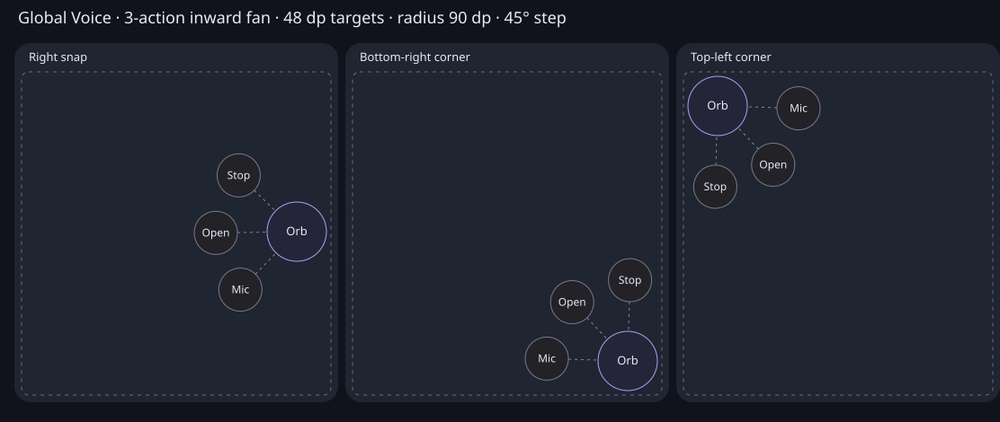

# Global Voice orb lifecycle, contrast and actions

Follow-up: [live input diagnosis and original microphone adapter parity](global-voice-live-input-diagnostics.md)
corrects the earlier assumption that raw RMS matched the original Particles microphone input.
The initial findings and validation below describe the earlier change, not physical-device proof.

## Diagnosis

The hypothesis is confirmed at the source boundary: Particles already implements all seven renderer states. Its listening ripple, thinking pulse/convergence, speaking flow/expansion, sphere geometry, alpha and additive particle blending match the pinned [VoiceOrbs source](https://github.com/amunozdev/voiceorbs/blob/339ab42d98f6c4ffa03709ffa71f9f6965a2171a/src/registry/orbe/particles-orb/particles-orb.tsx) and [state model](https://github.com/amunozdev/voiceorbs/blob/339ab42d98f6c4ffa03709ffa71f9f6965a2171a/src/registry/lib/orb-state.ts). There is no additional missing visual state to implement.

The old lifecycle reduction was order-dependent:

- Every realtime `itemAdded`, regardless of role/type, implied thinking.
- Every completed transcript, including user transcription, implied listening. Text completion was incorrectly used as playback completion.
- Remote audio could select speaking only when the preceding phase was thinking. Playback arriving without that exact precursor did nothing.
- User transcript deltas/VAD and normal hidden-thread turn/activity events did not drive the display phase.
- Resume unconditionally published listening, even after receiving a newer live phase.
- Particles selected the correct raw source but shared smoothing history between input and playback. A state switch could carry microphone energy into speaking. Nebula already had separate envelopes.

These are verified code defects. Their exact ordering on Sergey's physical device was not recorded in this task.

## Event and ownership path

1. Native ADM sample callback → `VoiceCaptureForegroundService` → `GlobalVoiceAudioLevelOwner`: bounded microphone RMS, coalesced publication, no PCM retained, no Activity visibility dependency.
2. Session-owned WebRTC stats → validated inbound audio level → token-scoped foreground lease → the same native level owner. Microphone stats cannot become playback energy.
3. Realtime live ingress → validated transcript/item events; session-owned data channel → validated content-free VAD edges. VAD is authoritative when available; transcript deltas/completion are the fallback for backends without those VAD edges.
4. Existing thread-event ingress → exact connection/thread qualification → live turn, item-start and thread-status activity. This is transient activation state, not another transcript or database.
5. `globalSupervisorSpeechState` replaces the old `speechPhase` reducer. Priority: confirmed user speech/barge-in → playback → home activity/pending response → listening. Playback starts independently of item order; a 450 ms quiet hold avoids switching on syllabic gaps. Transcript completion cannot drain playback. No new renderer enum is introduced.
6. Activation fencing → Legend render resource → exhaustive `globalVoiceOrbStateForPhase` → native bridge/service → overlay slot → Particles/Nebula. Connecting, failed, stopping and ready still map to connecting, error, disabled and idle. A stopped transport cannot publish late stats, VAD or activity.
7. Independent input/playback smoothing retains the port's attack/release rates and runs at native display cadence. Thinking uses only autonomous motion.

All event subscriptions, media ownership and phase reduction live outside mounted React views. The existing foreground service and overlay lifetimes are retained. Playback stats and semantic events still require the existing JS runtime to be scheduled; this patch does not claim to survive process termination or unrestricted OEM background suspension.

## Options and falsification

| Lane | Option | Result |
| --- | --- | --- |
| Incremental | Correct the existing phase reducer, connect missing events and separate audio envelope history | Selected: repairs demonstrated defects without adding visual states or changing transport |
| Structural | Move all semantic event reduction into the native foreground service | Deferred: adds another protocol boundary and does not remove the existing JS session owner |
| Radical | Replace the session with an entirely native WebRTC/control runtime | Conditional only if measured background JS suspension is the bottleneck. Potential upside: native continuity; risks: duplicated session/protocol work and a broad migration; reversibility requires retaining the current adapter. Cheapest experiment: record screen-off event/level continuity on a device before changing that boundary |

## Contrast

Original particle opacity is depth-dependent (`0.12 + depth² × 0.78`) and active particles use additive blending. The transparent system overlay supplied no controlled background. Raising every dot to full opacity would erase depth and still leave the figure dependent on arbitrary background content.

Only the Particles overlay receives a feathered dark backplate (`#121420`, center alpha `224/255`, constant through 78% of the radius, then fading to zero). The header and Nebula are unchanged. Particle alpha remains original. Additive blending is isolated in a transparent Canvas layer so particles add to each other, then compose over the backplate with source-over instead of adding directly to the dark contrast surface.

Tradeoff: the orb occupies a visible local dark patch on light backgrounds. There is no screenshot sampling, blur dependency, screen-wide dimming or full-opacity particle change. The native bitmap contract verifies at least 3:1 contrast for a representative front dot at depth 0.8 over white, black and saturated primary backgrounds; it intentionally does not claim that every faint rear dot meets 3:1. Transparent corners and a fading edge are also checked. A native rendered comparison is emitted as `build/reports/voice-overlay/codewide-orb-contrast.png` beneath the Android app project: original above, backplate below; light, dark and patterned columns.

The review copy is [the PNG comparison](assets/global-voice-orb-contrast.png). The original `/tmp` preview failure exposed an obsolete `PrivateTmp=true` in the Linux Companion service. Companion must share the host temporary directories so it can resolve agent-generated artifacts. The service templates now disable `PrivateTmp`, and deployment verification rejects isolated temporary directories. Keeping a review copy in the project is for persistence, not a preview-path restriction.

## Radial menu

Compared [Motion's central-button fan](https://motion.dev/examples/react-radial-menu), [React Native Motion's edge-aware radial menu](https://rnmotion.dev/animations/radial-menu) and a full orbital ring. The fan retains a central toggle and a compact footprint. A full ring is unsuitable at the existing snap edges. Long-press selection, global blur and vertical/text speed-dials are not part of this interaction.

Three circular 48 dp targets sit on a 90 dp radius with 45-degree separation: Mic, Open application, Stop. The rigid fan rotates toward the available safe area. It is never independently clamped into overlapping targets. Geometry tests cover free positions, both snap edges, four corners and multiple densities, including separation from the 76 dp central touch target.

The old code already contained a toggle, but the separate action window received `ACTION_OUTSIDE` while the orb owned its tap. That split could close the panel before the tap toggled it open again; the device-specific event ordering remains unverified. The new expanded window includes the central hit region and forwards that complete gesture to the existing orb gesture owner. It has one collapsed/expanded state and a reversible 180 ms animation from its current progress. No second show animation starts on a second tap.

- Central tap toggles; action targets become enabled when fully revealed.
- Outside tap collapses; Mic toggles the existing feature action and keeps the menu available.
- Drag collapses actions while preserving the original down/move/up sequence until release.
- Stop collapses and invokes the existing stop action. Open application collapses and launches the existing application entry.
- Insets/rotation rebuild geometry; terminal overlay removal cancels its animation.
- Ripple press feedback does not overwrite animation alpha. Reduced motion settles immediately.

## Validation

- `pnpm validate:android:v1`: passed formatting, native/web/compatibility types, 43 V1 suites/179 tests, 39 shared suites/135 tests, hygiene without regressions, Knip and dependency boundaries. Baseline unchanged.
- Focused Vitest: 8 files / 62 tests passed; lifecycle order, exact hidden-home activity, barge-in, playback hold, transcript ordering, invalid messages, stopped-session callbacks, feature resume, phase-to-native binding and existing reconnect/background contracts.
- Native Gradle unit tests: 37 tests passed; independent PCM/playback delivery, envelope attack/release and no cross-source carry, original Particles motion, actual bitmap contrast, radial safe bounds, central toggle, reversal, outside tap and drag continuity.
- Physical-device microphone/playback perception, system-window event delivery, frame pacing and OEM screen-off behavior remain unverified. No commit, push, APK build or publication is part of this task.
