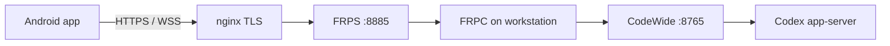
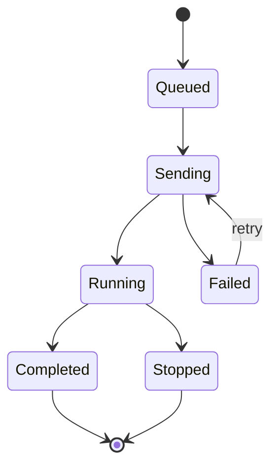
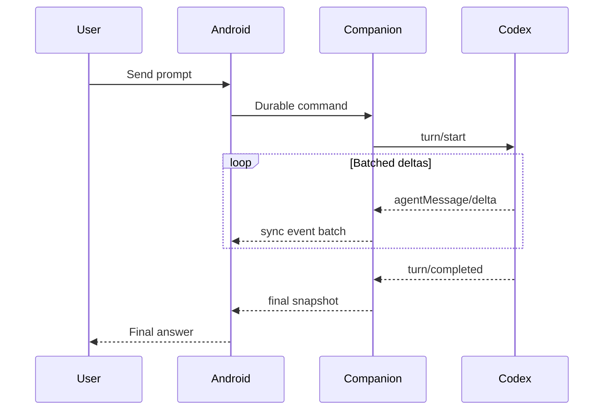
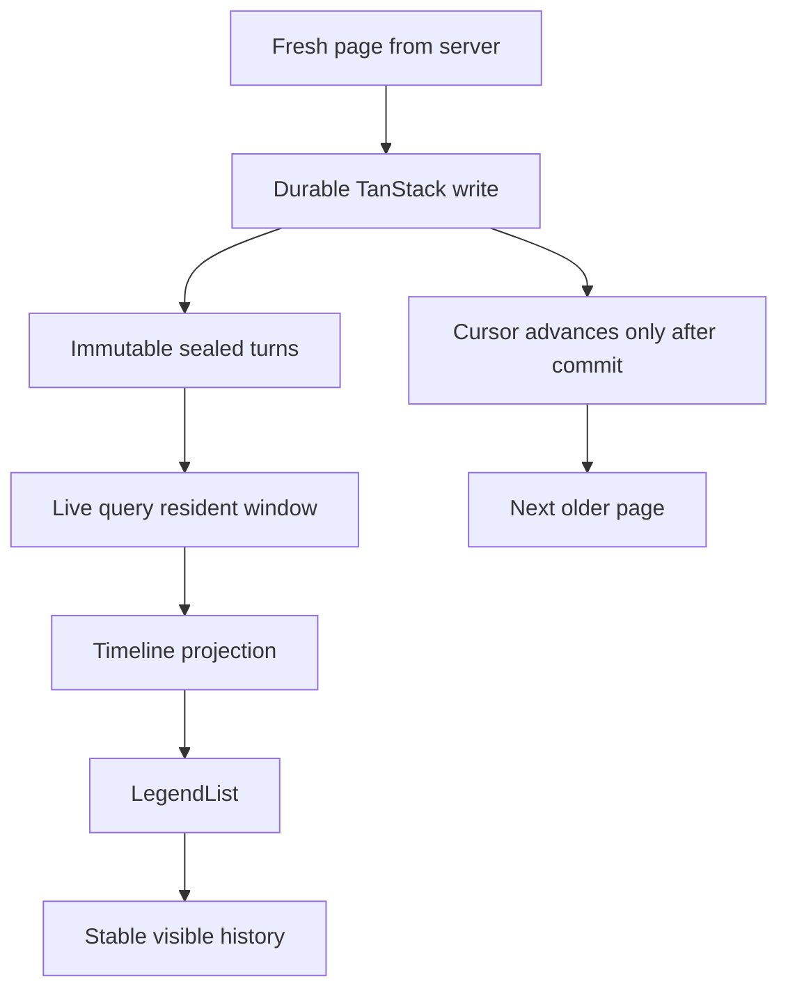

# Mermaid renderer test

Этот файл проверяет inline-рендер, ширину bubble, fullscreen, pan и zoom.

## Remote connection flow

## Turn lifecycle

## Streaming sequence

## Wide diagram

| Check | Expected |
| --- | --- |
| Inline | Diagram fills the bubble width |
| Fullscreen | Diagram starts centered |
| Pan/zoom | Large outer gutters leave room to drag |
| Safety | No network access from the renderer |
